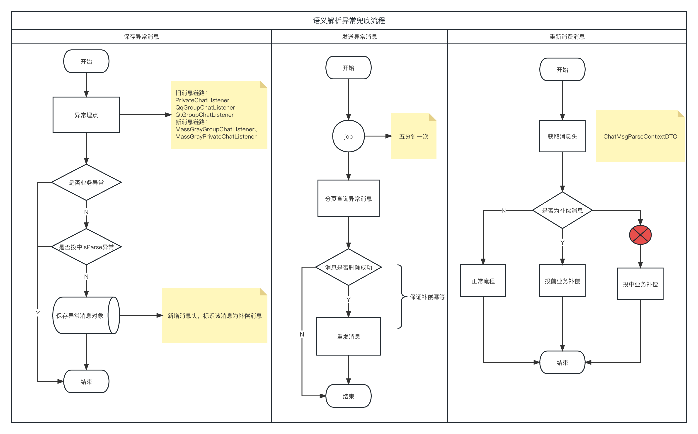

[toc]


## 1. 基金代销优化

### 1.1 撤单接口返回信息优化

- `retcode` = `0` 
  - `OrderRes`=`2` || `3`, 返回 `OrderDesc`；且不更新原交易状态
  - `OrderRes`=`1`, 更新交易状态为“已撤单”； 前端展示成功提示；
- `retcode` != `0`
  - 返回 `retmsg`
  - 且不更新原交易状态

### 1.2 接口返回提示优化（展示返回原因）

#### 1.2.1 交易订单表新增字段

```mysql
ALTER TABLE db_polaris_fund.t_fund_order ADD COLUMN `Ferror_msg` varchar(256) DEFAULT NULL COMMENT '异常信息描述';

```

#### 1.2.2 基金认申购、基金赎回、基金转换、基金分行方式变更提交接口修改

- `FundOrderSubmitVO` 新增==订单失败数据==及==状态描述集合==
- 订单数据更新
  - 失败逻辑：`retCode` !=`0` || （`retCode`==`0` `&&` `OrderRes`!=`1`）
  - 更新字段：订单状态及==异常信息描述==
- 查询失败订单的基金数据


#### 1.2.3 提交重试接口

- 新增 `FundOrderSubmitVO` 返回对象
- 查询失败订单的基金数据


#### 1.2.4 交易明细查询

- 新增状态描述字段


## 2. 语义解析异常兜底

### 2.1 component

- 复用 `@RabbitMqReceiver` 功能
- 修改点：
  - `RabbitMqReceiver` 新增自定义 `service`，处理保存逻辑；（`insert` ... `on` `duplicate` `update`）
  - 新增 `exchange`、`routingkey`
  - 修改发送消息逻辑，消息头携带==补偿消息标识==，发送到指定 `exchagne`，`routingkey`


### 2.2 chat-parse

#### 2.2.1 新增异常消息表

```mysql
CREATE TABLE `t_abnormal_message` (
  `Fid` bigint(19) unsigned NOT NULL AUTO_INCREMENT COMMENT '主键，自增',
  `Fmessage_id` varchar(50) NOT NULL DEFAULT '' COMMENT '消息id',
  `Fexchange` varchar(100)  NOT NULL DEFAULT '' COMMENT '交换机',
  `Frouting_key` varchar(100) NOT NULL DEFAULT '' COMMENT '路由key',
  `Fmessage_body` longtext COMMENT '消息体',
  `Fmessage_content` longtext COMMENT '消息内容',
  `Fauto_refresh_flag` int(1) NOT NULL DEFAULT '0' COMMENT '是否自动重刷',
  `Fcreated_time` timestamp NOT NULL DEFAULT CURRENT_TIMESTAMP COMMENT '创建时间',
  `Fupdated_time` timestamp NOT NULL DEFAULT CURRENT_TIMESTAMP ON UPDATE CURRENT_TIMESTAMP COMMENT '修改时间',
  PRIMARY KEY (`Fid`),
  UNIQUE KEY `idx_message_id` (`Fmessage_id`),
  KEY `idx_auto_refresh` (`Fauto_refresh_flag`)
) ENGINE=InnoDB AUTO_INCREMENT=4 DEFAULT CHARSET=utf8mb4 COMMENT='异常消息表';
```

#### 2.2.2 语义解析异常兜底流程



​	