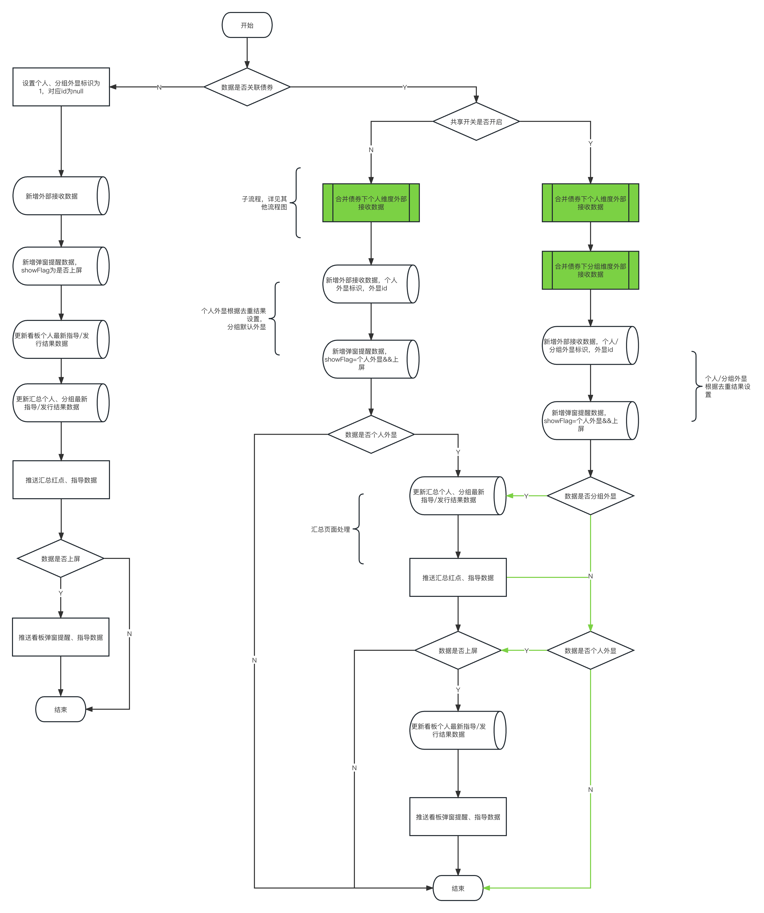
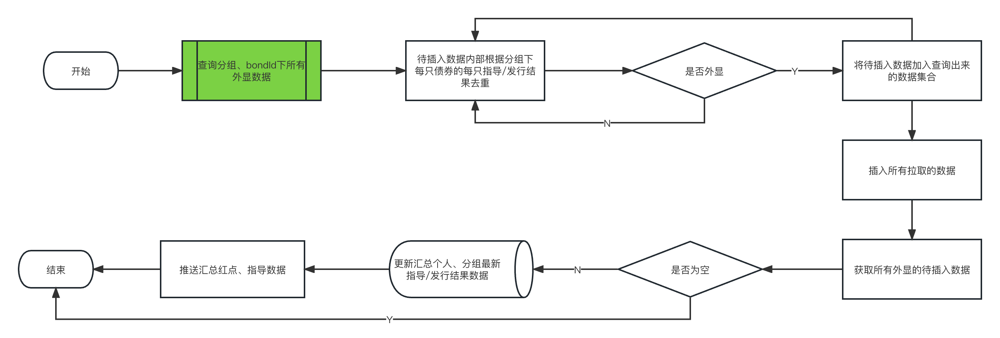
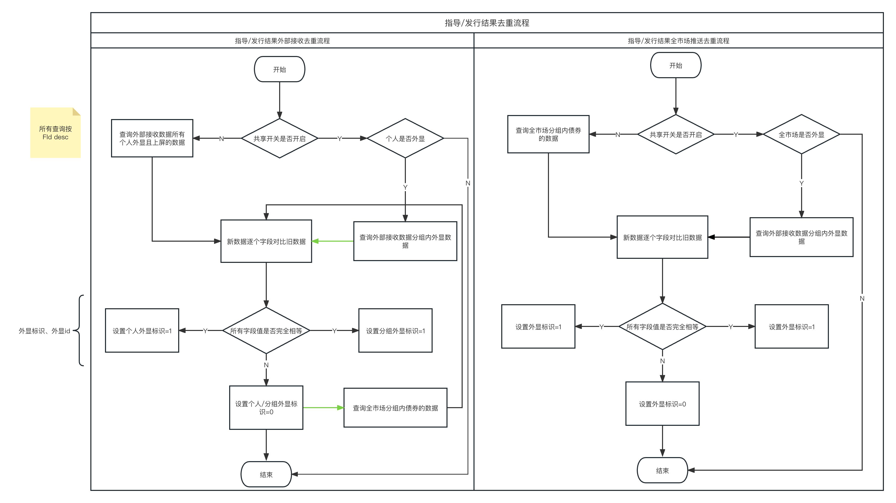

## 1. 需求文档

### 1.1 文档地址

> [指导汇总&发行结果汇总去重及相关优化](https://www.tapd.cn/62488930/prong/stories/view/1162488930001012737?url_cache_key=from_url_iteration_list_0409fca0abfbf79af454a7800e90ae7c&action_entry_type=stories)

## 2. 系统方案设计

### 2.1 新增表字段

```sql
# 全市场推送记录，只有分组维度
ALTER TABLE db_primary_bond_sale.t_whole_market_data_sync_record ADD COLUMN `Fexplicit_flag` int(1) NOT NULL DEFAULT '1' COMMENT '分组外显标识：0-不外显；1-外显';
ALTER TABLE db_primary_bond_sale.t_whole_market_data_sync_record ADD COLUMN `Fexplicit_biz_id` bigint(21) unsigned DEFAULT NULL COMMENT '不外显：有值，存对应外显的记录主键；外显：为空';

# 外部指导接收表 t_v2_nlp_region_guide_receive
ALTER TABLE db_primary_bond_sale.t_v2_nlp_region_guide_receive ADD COLUMN `Fpersonal_explicit_flag` int(1) NOT NULL DEFAULT '1' COMMENT '个人维度外显标识：0-不外显；1-外显';
ALTER TABLE db_primary_bond_sale.t_v2_nlp_region_guide_receive ADD COLUMN `Fpersonal_explicit_biz_id` bigint(21) unsigned DEFAULT NULL COMMENT '不外显且上屏：有值，存对应外显的记录主键；外显：为空';
ALTER TABLE db_primary_bond_sale.t_v2_nlp_region_guide_receive ADD COLUMN `Ftenant_explicit_flag` int(1) NOT NULL DEFAULT '1' COMMENT '分组维度外显标识：0-不外显；1-外显';
ALTER TABLE db_primary_bond_sale.t_v2_nlp_region_guide_receive ADD COLUMN `Ftenant_explicit_biz_id` bigint(21) unsigned DEFAULT NULL COMMENT '不外显且上屏：有值，存对应外显的记录主键；外显：为空';
# 外部发行结果接收表 t_nlp_issue_result_receive
ALTER TABLE db_primary_bond_sale.t_nlp_issue_result_receive ADD COLUMN `Fpersonal_explicit_flag` int(1) NOT NULL DEFAULT '1' COMMENT '个人维度外显标识：0-不外显；1-外显';
ALTER TABLE db_primary_bond_sale.t_nlp_issue_result_receive ADD COLUMN `Fpersonal_explicit_biz_id` bigint(21) unsigned DEFAULT NULL COMMENT '不外显且上屏：有值，存对应外显的记录主键；外显：为空';
ALTER TABLE db_primary_bond_sale.t_nlp_issue_result_receive ADD COLUMN `Ftenant_explicit_flag` int(1) NOT NULL DEFAULT '1' COMMENT '分组维度外显标识：0-不外显；1-外显';
ALTER TABLE db_primary_bond_sale.t_nlp_issue_result_receive ADD COLUMN `Ftenant_explicit_biz_id` bigint(21) unsigned DEFAULT NULL COMMENT '不外显且上屏：有值，存对应外显的记录主键；外显：为空';


# t_v2_nlp_region_guide_receive_history
ALTER TABLE db_primary_bond_sale.t_v2_nlp_region_guide_receive_history ADD COLUMN `Fpersonal_explicit_flag` int(1) NOT NULL DEFAULT '1' COMMENT '个人维度外显标识：0-不外显；1-外显';
ALTER TABLE db_primary_bond_sale.t_v2_nlp_region_guide_receive_history ADD COLUMN `Fpersonal_explicit_biz_id` bigint(21) unsigned DEFAULT NULL COMMENT '不外显且上屏：有值，存对应外显的记录主键；外显：为空';
ALTER TABLE db_primary_bond_sale.t_v2_nlp_region_guide_receive_history ADD COLUMN `Ftenant_explicit_flag` int(1) NOT NULL DEFAULT '1' COMMENT '分组维度外显标识：0-不外显；1-外显';
ALTER TABLE db_primary_bond_sale.t_v2_nlp_region_guide_receive_history ADD COLUMN `Ftenant_explicit_biz_id` bigint(21) unsigned DEFAULT NULL COMMENT '不外显且上屏：有值，存对应外显的记录主键；外显：为空';

# t_nlp_issue_result_receive_history
ALTER TABLE db_primary_bond_sale.t_nlp_issue_result_receive_history ADD COLUMN `Fpersonal_explicit_flag` int(1) NOT NULL DEFAULT '1' COMMENT '个人维度外显标识：0-不外显；1-外显';
ALTER TABLE db_primary_bond_sale.t_nlp_issue_result_receive_history ADD COLUMN `Fpersonal_explicit_biz_id` bigint(21) unsigned DEFAULT NULL COMMENT '不外显且上屏：有值，存对应外显的记录主键；外显：为空';
ALTER TABLE db_primary_bond_sale.t_nlp_issue_result_receive_history ADD COLUMN `Ftenant_explicit_flag` int(1) NOT NULL DEFAULT '1' COMMENT '分组维度外显标识：0-不外显；1-外显';
ALTER TABLE db_primary_bond_sale.t_nlp_issue_result_receive_history ADD COLUMN `Ftenant_explicit_biz_id` bigint(21) unsigned DEFAULT NULL COMMENT '不外显且上屏：有值，存对应外显的记录主键；外显：为空';
```

### 2.2 外部指导、发行结果接收去重流程



### 2.3 全市场拉取去重流程




### 2.4 指导、发行结果去重逻辑




##### 示例

| 指导区间    | 发行人预期 | 边际利率 | 全场倍数 | 边际倍数 | 截标时间         | 团费/佣金 | Fid  |
| ----------- | ---------- | -------- | -------- | -------- | ---------------- | --------- | ---- |
| **4.5-5.2** |            | **2**    | **1**    | **1**    | **2023-07-26**   |           |      |
| 4.5-5.2     |            | 2        | 1        | 1        | 2023-07-26 00:00 |           |      |
| 1-2         |            | 3        | 1        | 2        |                  |           |      |
| 2-3         |            |          |          |          |                  |           |      |
| ==4.5-5.2== | ==1==      | ==2==    | ==1==    | ==1==    | ==2023-07-26==   |           | 100  |
| 4.5-5.2     | 2          | 2        | 1        | 1        | 2023/07/26       |           |      |
|             |            |          |          |          |                  |           |      |
| 4.5-5.2     |            | 2        | 1        | 1        | 2023-07-26       |           | 10   |
|             |            |          |          |          |                  |           |      |