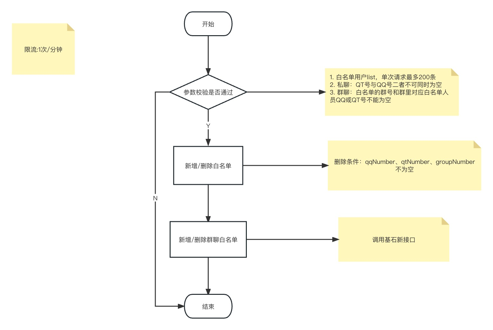

[toc]


## 1. 新增表结构

```mysql
-- 基金交易白名单
-- DROP TABLE if EXISTS `db_polaris_fund`.`t_fund_trade_white_list`;
CREATE TABLE `db_polaris_fund`.`t_fund_trade_white_list` (
  `Fid` bigint(21) unsigned NOT NULL AUTO_INCREMENT COMMENT '自增id',
	`Forder_id` varchar(64) DEFAULT NULL COMMENT 'orderId',
  `Fwhite_type` int(8) NOT NULL COMMENT '白名单类型：1-群聊；2-私聊',
  `Fuuid` varchar(128) NOT NULL COMMENT '唯一id',
  `Fqt_number` varchar(32) DEFAULT NULL COMMENT 'qt号',
  `Fqq_number` varchar(32) DEFAULT NULL COMMENT 'qq号',
  `Fgroup_number` varchar(32) DEFAULT NULL COMMENT '群号',
	`Fsource_type` int(1) DEFAULT '1' COMMENT '来源：1-发送方；2-接收方',
  `Fdata_status` int(1) DEFAULT '1' COMMENT '数据状态，默认1，0删除，1启用',
  `Fcreate_time` timestamp NOT NULL DEFAULT CURRENT_TIMESTAMP COMMENT '创建时间',
  `Fupdate_time` timestamp NOT NULL DEFAULT CURRENT_TIMESTAMP ON UPDATE CURRENT_TIMESTAMP COMMENT '更新时间',
  PRIMARY KEY (`Fid`),
  UNIQUE KEY `idx_uuid` (`Fuuid`) USING BTREE,
  KEY `idx_qt_number` (`Fqt_number`) USING BTREE,
  KEY `idx_qq_number` (`Fqq_number`) USING BTREE,
  KEY `idx_group_number` (`Fgroup_number`) USING BTREE
) ENGINE=InnoDB AUTO_INCREMENT=1 DEFAULT CHARSET=utf8mb4 COMMENT='基金交易白名单表';

-- 基金信息表
-- DROP TABLE if EXISTS `db_polaris_fund`.`t_fund_info`;
CREATE TABLE `db_polaris_fund`.`t_fund_info` (
  `Fid` bigint(21) unsigned NOT NULL AUTO_INCREMENT COMMENT '自增id',
  `Ffund_id` varchar(32) NOT NULL COMMENT '基金代码',
  `Ffund_name` varchar(64) DEFAULT NULL COMMENT '基金名称',
  `Ffund_manager` varchar(128) DEFAULT NULL COMMENT '基金管理人名称',
  `Ffund_limit_amount` decimal(14,2) DEFAULT NULL COMMENT '基金单日限额',
  `Fdata_status` int(1) DEFAULT '1' COMMENT '数据状态，默认1，0删除，1启用',
  `Fcreate_time` timestamp NOT NULL DEFAULT CURRENT_TIMESTAMP COMMENT '创建时间',
  `Fupdate_time` timestamp NOT NULL DEFAULT CURRENT_TIMESTAMP ON UPDATE CURRENT_TIMESTAMP COMMENT '更新时间',
  PRIMARY KEY (`Fid`),
  UNIQUE KEY `idx_fund_id` (`Ffund_id`) USING BTREE,
  KEY `idx_fund_name` (`Ffund_name`) USING BTREE
) ENGINE=InnoDB AUTO_INCREMENT=1 DEFAULT CHARSET=utf8mb4 COMMENT='基金信息表';

-- drop TABLE if EXISTS `db_polaris_fund`.`t_fund_order`;
-- 基金订单表
CREATE TABLE `db_polaris_fund`.`t_fund_order` (
   `Fid` bigint(21) unsigned NOT NULL AUTO_INCREMENT COMMENT '自增id',
   `Faccept_id` varchar(64) NOT NULL COMMENT '受理编号',
   `Faccount_name` varchar(64) NOT NULL COMMENT '产品账户名称',
   `Fapply_date` date NOT NULL COMMENT '申请日',
   `Ffund_id` varchar(32) NOT NULL COMMENT '基金代码',
   `Ffund_name` varchar(64) DEFAULT NULL COMMENT '基金名称',
   `Ftemplate_type` int(1) NOT NULL COMMENT '1-基金认申购；2-基金赎回；3-基金转换；4-基金分红方式变更；5-基金认申购撤销；6-基金赎回撤销；7-基金转换回撤销；8-基金分红方式撤销',
   `Fapply_amount` decimal(14,2) DEFAULT NULL COMMENT '申请金额',
   `Fdividend_type` int(1) DEFAULT NULL COMMENT '分红方式：1-现金分红；2-红利再投',
   `Fredeem_type` int(1) DEFAULT NULL COMMENT '赎回方式：1-部分赎回；2-全部赎回',
   `Fredeem_share` decimal(14,2) DEFAULT NULL COMMENT '赎回份额',
   `Fconvert_share` decimal(14,2) DEFAULT NULL COMMENT '转出份额',
   `Ftarget_fund_id` varchar(32) DEFAULT NULL COMMENT '目标基金代码',
   `Ftarget_fund_name` varchar(64) DEFAULT NULL COMMENT '目标基金名称',
   `Ftarget_dividend_type` int(1) DEFAULT NULL COMMENT '目标分红方式：1-现金分红；2-红利再投',
   `Fbusiness_status` int(1) not null DEFAULT '0' COMMENT '交易状态：0-提交中；1-受理中；2-已受理；3-已确认；4-已撤销；9-已超时',
   `Fsort_position` int(1) not null COMMENT '数据排序：1-提交中；2-已超时；3-受理中；4-已受理；5-已确认；6-已撤销',
   `Fchannel` int(1) not null COMMENT '受理渠道：1-私聊；2-群聊；3-群右面板',
   `Fqt_number` varchar(32) DEFAULT NULL COMMENT 'qt号',
   `Fqq_number` varchar(32) DEFAULT NULL COMMENT 'qq号',
   `Fapply_name` varchar(64) DEFAULT NULL COMMENT '申请人名称',
   `Fapply_group_num` varchar(16) DEFAULT NULL COMMENT '申请人发起交易群号',
   `Fdata_status` int(1) DEFAULT '1' COMMENT '数据状态，默认1，0删除，1启用',
   `Fcreate_time` timestamp NOT NULL DEFAULT CURRENT_TIMESTAMP COMMENT '创建时间',
   `Fupdate_time` timestamp NOT NULL DEFAULT CURRENT_TIMESTAMP ON UPDATE CURRENT_TIMESTAMP COMMENT '更新时间',
   PRIMARY KEY (`Fid`),
   UNIQUE KEY `idx_accept_id` (`Faccept_id`) USING BTREE,
   KEY `idx_apply_date` (`Fapply_date`) USING BTREE
) ENGINE=InnoDB AUTO_INCREMENT=1 DEFAULT CHARSET=utf8mb4 COMMENT='基金订单表';
```


## 2. 基金交易下单相关接口

### 2.1 基金交易白名单接口

#### 2.1.1 基石白名单接口流程


### 2.2 基金信息上行接口

- 根据 `fund_id` 新增/更新 基金信息
- 初始化暂不限制频控，list最大`1000`条；后续增量同步时频控`5`次/分

### 2.3 基金查询下行接口
- 将关键字赋值到`FundID` 精确查询

### 2.4 基金认购、赎回、转换、分红、撤销接口

- orderId：uuid
- 必填参数校验
- AcceptID：后四位流水号为当天递增(redis原子递增，左侧填充‘0‘)
- 请求时，QT会给指定的用户或群发送消息提醒。
- 接收返回信息后，若为成功，更新校验状态为：受理中；

### 2.5 基金交易状态上行接口
- 根据 `OriginalAcceptID` 更新交易状态

## 3. `Excel` 下单
### 3.1 波行白名单维护流程

### 3.2 `erp` 新增分组人员

### 3.3 `Excel` 基金交易下单流程


## 4. 群右面板下单
### 4.1 基金认购、转换、分红、赎回

#### 4.1.1 权限控制
接口权限控制，需要在群白名单里面的才能操作
> 错误提示：您暂未开通QTrade渠道基金交易权限，请联系宁波银行同业易管家平台

#### 4.1.2 通过基金代码或简称查询接口


#### 4.1.3 提交接口


### 4.2 基金撤销受理

#### 4.2.1 权限控制
接口权限控制，需要在群白名单里面的才能操作
> 错误提示：您暂未开通QTrade渠道基金交易权限，请联系宁波银行同业易管家平台

#### 4.2.2 基金交易明细查询

- 不同页签查询不用业务状态的数据，撤销 `type` in (5,6,7,8)
- 查询条件
    - 关键字查询：支持输入基金代码或基金简称模糊查询
    - 日期查询
        - 今日：查询交易申请日=系统日期的基金认购/申购受理信息
        - 本周：查询交易申请日>=周一
    - 排序：默认按照“提交中”、“已超时”、“受理中”、“已受理”、“已确认”、“已撤销”状态排序，同一状态的，更新时间最新的放在最上面。

#### 4.2.3 撤销操作


## 5. 基金下单数据清理

针对通过QTrade发起的基金交易（聊天框Excel下单和群右面板下单），QTrade仅允许保留`1`周。

## 6. 新建工程、数据库开发基金交易