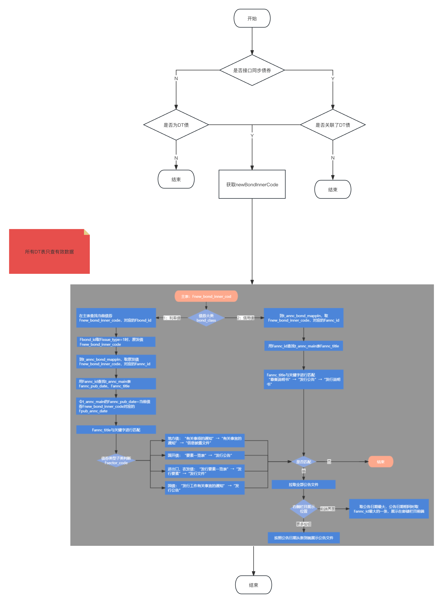

[toc]


## 1. 公域/私域债券同步流程

### 1.1 新增公域债券 `id` 分表

```sql

CREATE TABLE db_primary_bond_sale.`t_dt_share_bond_key_1`
(
    `Fid`              bigint(21) unsigned NOT NULL AUTO_INCREMENT COMMENT '自增id',
    `Fbond_id`         bigint(21) unsigned NOT NULL COMMENT '关联债券Id',
    `Fbond_inner_code` int(11) NOT NULL COMMENT 'newBondInnerCode',
    `Forg_id`          varchar(127) NOT NULL COMMENT '机构id',
    `Ftenant_id`       bigint(19) unsigned NOT NULL COMMENT '本方分组id',
    `Fcreate_time`     timestamp    NOT NULL DEFAULT CURRENT_TIMESTAMP COMMENT '创建时间',
    `Fupdate_time`     timestamp    NOT NULL DEFAULT CURRENT_TIMESTAMP ON UPDATE CURRENT_TIMESTAMP COMMENT '更新时间',
    PRIMARY KEY (`Fid`),
    KEY                `idx_bond_id` (`Fbond_id`) USING BTREE,
    UNIQUE KEY `idx_tenant_id_bond_inner_code` (`Ftenant_id`, `Fbond_inner_code`) USING BTREE
) ENGINE=InnoDB AUTO_INCREMENT=1 DEFAULT CHARSET=utf8mb4 COMMENT='dt公域债券id表';

CREATE TABLE db_primary_bond_sale.`t_dt_share_bond_key_2`
(
    `Fid`              bigint(21) unsigned NOT NULL AUTO_INCREMENT COMMENT '自增id',
    `Fbond_id`         bigint(21) unsigned NOT NULL COMMENT '关联债券Id',
    `Fbond_inner_code` int(11) NOT NULL COMMENT 'newBondInnerCode',
    `Forg_id`          varchar(127) NOT NULL COMMENT '机构id',
    `Ftenant_id`       bigint(19) unsigned NOT NULL COMMENT '本方分组id',
    `Fcreate_time`     timestamp    NOT NULL DEFAULT CURRENT_TIMESTAMP COMMENT '创建时间',
    `Fupdate_time`     timestamp    NOT NULL DEFAULT CURRENT_TIMESTAMP ON UPDATE CURRENT_TIMESTAMP COMMENT '更新时间',
    PRIMARY KEY (`Fid`),
    KEY                `idx_bond_id` (`Fbond_id`) USING BTREE,
    UNIQUE KEY `idx_tenant_id_bond_inner_code` (`Ftenant_id`, `Fbond_inner_code`) USING BTREE
) ENGINE=InnoDB AUTO_INCREMENT=1 DEFAULT CHARSET=utf8mb4 COMMENT='dt公域债券id表';


CREATE TABLE db_primary_bond_sale.`t_dt_share_bond_key_3`
(
    `Fid`              bigint(21) unsigned NOT NULL AUTO_INCREMENT COMMENT '自增id',
    `Fbond_id`         bigint(21) unsigned NOT NULL COMMENT '关联债券Id',
    `Fbond_inner_code` int(11) NOT NULL COMMENT 'newBondInnerCode',
    `Forg_id`          varchar(127) NOT NULL COMMENT '机构id',
    `Ftenant_id`       bigint(19) unsigned NOT NULL COMMENT '本方分组id',
    `Fcreate_time`     timestamp    NOT NULL DEFAULT CURRENT_TIMESTAMP COMMENT '创建时间',
    `Fupdate_time`     timestamp    NOT NULL DEFAULT CURRENT_TIMESTAMP ON UPDATE CURRENT_TIMESTAMP COMMENT '更新时间',
    PRIMARY KEY (`Fid`),
    KEY                `idx_bond_id` (`Fbond_id`) USING BTREE,
    UNIQUE KEY `idx_tenant_id_bond_inner_code` (`Ftenant_id`, `Fbond_inner_code`) USING BTREE
) ENGINE=InnoDB AUTO_INCREMENT=1 DEFAULT CHARSET=utf8mb4 COMMENT='dt公域债券id表';


CREATE TABLE db_primary_bond_sale.`t_dt_share_bond_key_4`
(
    `Fid`              bigint(21) unsigned NOT NULL AUTO_INCREMENT COMMENT '自增id',
    `Fbond_id`         bigint(21) unsigned NOT NULL COMMENT '关联债券Id',
    `Fbond_inner_code` int(11) NOT NULL COMMENT 'newBondInnerCode',
    `Forg_id`          varchar(127) NOT NULL COMMENT '机构id',
    `Ftenant_id`       bigint(19) unsigned NOT NULL COMMENT '本方分组id',
    `Fcreate_time`     timestamp    NOT NULL DEFAULT CURRENT_TIMESTAMP COMMENT '创建时间',
    `Fupdate_time`     timestamp    NOT NULL DEFAULT CURRENT_TIMESTAMP ON UPDATE CURRENT_TIMESTAMP COMMENT '更新时间',
    PRIMARY KEY (`Fid`),
    KEY                `idx_bond_id` (`Fbond_id`) USING BTREE,
    UNIQUE KEY `idx_tenant_id_bond_inner_code` (`Ftenant_id`, `Fbond_inner_code`) USING BTREE
) ENGINE=InnoDB AUTO_INCREMENT=1 DEFAULT CHARSET=utf8mb4 COMMENT='dt公域债券id表';


CREATE TABLE db_primary_bond_sale.`t_dt_share_bond_key_5`
(
    `Fid`              bigint(21) unsigned NOT NULL AUTO_INCREMENT COMMENT '自增id',
    `Fbond_id`         bigint(21) unsigned NOT NULL COMMENT '关联债券Id',
    `Fbond_inner_code` int(11) NOT NULL COMMENT 'newBondInnerCode',
    `Forg_id`          varchar(127) NOT NULL COMMENT '机构id',
    `Ftenant_id`       bigint(19) unsigned NOT NULL COMMENT '本方分组id',
    `Fcreate_time`     timestamp    NOT NULL DEFAULT CURRENT_TIMESTAMP COMMENT '创建时间',
    `Fupdate_time`     timestamp    NOT NULL DEFAULT CURRENT_TIMESTAMP ON UPDATE CURRENT_TIMESTAMP COMMENT '更新时间',
    PRIMARY KEY (`Fid`),
    KEY                `idx_bond_id` (`Fbond_id`) USING BTREE,
    UNIQUE KEY `idx_tenant_id_bond_inner_code` (`Ftenant_id`, `Fbond_inner_code`) USING BTREE
) ENGINE=InnoDB AUTO_INCREMENT=1 DEFAULT CHARSET=utf8mb4 COMMENT='dt公域债券id表';


CREATE TABLE db_primary_bond_sale.`t_dt_share_bond_key_6`
(
    `Fid`              bigint(21) unsigned NOT NULL AUTO_INCREMENT COMMENT '自增id',
    `Fbond_id`         bigint(21) unsigned NOT NULL COMMENT '关联债券Id',
    `Fbond_inner_code` int(11) NOT NULL COMMENT 'newBondInnerCode',
    `Forg_id`          varchar(127) NOT NULL COMMENT '机构id',
    `Ftenant_id`       bigint(19) unsigned NOT NULL COMMENT '本方分组id',
    `Fcreate_time`     timestamp    NOT NULL DEFAULT CURRENT_TIMESTAMP COMMENT '创建时间',
    `Fupdate_time`     timestamp    NOT NULL DEFAULT CURRENT_TIMESTAMP ON UPDATE CURRENT_TIMESTAMP COMMENT '更新时间',
    PRIMARY KEY (`Fid`),
    KEY                `idx_bond_id` (`Fbond_id`) USING BTREE,
    UNIQUE KEY `idx_tenant_id_bond_inner_code` (`Ftenant_id`, `Fbond_inner_code`) USING BTREE
) ENGINE=InnoDB AUTO_INCREMENT=1 DEFAULT CHARSET=utf8mb4 COMMENT='dt公域债券id表';


CREATE TABLE db_primary_bond_sale.`t_dt_share_bond_key_7`
(
    `Fid`              bigint(21) unsigned NOT NULL AUTO_INCREMENT COMMENT '自增id',
    `Fbond_id`         bigint(21) unsigned NOT NULL COMMENT '关联债券Id',
    `Fbond_inner_code` int(11) NOT NULL COMMENT 'newBondInnerCode',
    `Forg_id`          varchar(127) NOT NULL COMMENT '机构id',
    `Ftenant_id`       bigint(19) unsigned NOT NULL COMMENT '本方分组id',
    `Fcreate_time`     timestamp    NOT NULL DEFAULT CURRENT_TIMESTAMP COMMENT '创建时间',
    `Fupdate_time`     timestamp    NOT NULL DEFAULT CURRENT_TIMESTAMP ON UPDATE CURRENT_TIMESTAMP COMMENT '更新时间',
    PRIMARY KEY (`Fid`),
    KEY                `idx_bond_id` (`Fbond_id`) USING BTREE,
    UNIQUE KEY `idx_tenant_id_bond_inner_code` (`Ftenant_id`, `Fbond_inner_code`) USING BTREE
) ENGINE=InnoDB AUTO_INCREMENT=1 DEFAULT CHARSET=utf8mb4 COMMENT='dt公域债券id表';


CREATE TABLE db_primary_bond_sale.`t_dt_share_bond_key_8`
(
    `Fid`              bigint(21) unsigned NOT NULL AUTO_INCREMENT COMMENT '自增id',
    `Fbond_id`         bigint(21) unsigned NOT NULL COMMENT '关联债券Id',
    `Fbond_inner_code` int(11) NOT NULL COMMENT 'newBondInnerCode',
    `Forg_id`          varchar(127) NOT NULL COMMENT '机构id',
    `Ftenant_id`       bigint(19) unsigned NOT NULL COMMENT '本方分组id',
    `Fcreate_time`     timestamp    NOT NULL DEFAULT CURRENT_TIMESTAMP COMMENT '创建时间',
    `Fupdate_time`     timestamp    NOT NULL DEFAULT CURRENT_TIMESTAMP ON UPDATE CURRENT_TIMESTAMP COMMENT '更新时间',
    PRIMARY KEY (`Fid`),
    KEY                `idx_bond_id` (`Fbond_id`) USING BTREE,
    UNIQUE KEY `idx_tenant_id_bond_inner_code` (`Ftenant_id`, `Fbond_inner_code`) USING BTREE
) ENGINE=InnoDB AUTO_INCREMENT=1 DEFAULT CHARSET=utf8mb4 COMMENT='dt公域债券id表';


CREATE TABLE db_primary_bond_sale.`t_dt_share_bond_key_9`
(
    `Fid`              bigint(21) unsigned NOT NULL AUTO_INCREMENT COMMENT '自增id',
    `Fbond_id`         bigint(21) unsigned NOT NULL COMMENT '关联债券Id',
    `Fbond_inner_code` int(11) NOT NULL COMMENT 'newBondInnerCode',
    `Forg_id`          varchar(127) NOT NULL COMMENT '机构id',
    `Ftenant_id`       bigint(19) unsigned NOT NULL COMMENT '本方分组id',
    `Fcreate_time`     timestamp    NOT NULL DEFAULT CURRENT_TIMESTAMP COMMENT '创建时间',
    `Fupdate_time`     timestamp    NOT NULL DEFAULT CURRENT_TIMESTAMP ON UPDATE CURRENT_TIMESTAMP COMMENT '更新时间',
    PRIMARY KEY (`Fid`),
    KEY                `idx_bond_id` (`Fbond_id`) USING BTREE,
    UNIQUE KEY `idx_tenant_id_bond_inner_code` (`Ftenant_id`, `Fbond_inner_code`) USING BTREE
) ENGINE=InnoDB AUTO_INCREMENT=1 DEFAULT CHARSET=utf8mb4 COMMENT='dt公域债券id表';


CREATE TABLE db_primary_bond_sale.`t_dt_share_bond_key_10`
(
    `Fid`              bigint(21) unsigned NOT NULL AUTO_INCREMENT COMMENT '自增id',
    `Fbond_id`         bigint(21) unsigned NOT NULL COMMENT '关联债券Id',
    `Fbond_inner_code` int(11) NOT NULL COMMENT 'newBondInnerCode',
    `Forg_id`          varchar(127) NOT NULL COMMENT '机构id',
    `Ftenant_id`       bigint(19) unsigned NOT NULL COMMENT '本方分组id',
    `Fcreate_time`     timestamp    NOT NULL DEFAULT CURRENT_TIMESTAMP COMMENT '创建时间',
    `Fupdate_time`     timestamp    NOT NULL DEFAULT CURRENT_TIMESTAMP ON UPDATE CURRENT_TIMESTAMP COMMENT '更新时间',
    PRIMARY KEY (`Fid`),
    KEY                `idx_bond_id` (`Fbond_id`) USING BTREE,
    UNIQUE KEY `idx_tenant_id_bond_inner_code` (`Ftenant_id`, `Fbond_inner_code`) USING BTREE
) ENGINE=InnoDB AUTO_INCREMENT=1 DEFAULT CHARSET=utf8mb4 COMMENT='dt公域债券id表';


CREATE TABLE db_primary_bond_sale.`t_dt_share_bond_key_11`
(
    `Fid`              bigint(21) unsigned NOT NULL AUTO_INCREMENT COMMENT '自增id',
    `Fbond_id`         bigint(21) unsigned NOT NULL COMMENT '关联债券Id',
    `Fbond_inner_code` int(11) NOT NULL COMMENT 'newBondInnerCode',
    `Forg_id`          varchar(127) NOT NULL COMMENT '机构id',
    `Ftenant_id`       bigint(19) unsigned NOT NULL COMMENT '本方分组id',
    `Fcreate_time`     timestamp    NOT NULL DEFAULT CURRENT_TIMESTAMP COMMENT '创建时间',
    `Fupdate_time`     timestamp    NOT NULL DEFAULT CURRENT_TIMESTAMP ON UPDATE CURRENT_TIMESTAMP COMMENT '更新时间',
    PRIMARY KEY (`Fid`),
    KEY                `idx_bond_id` (`Fbond_id`) USING BTREE,
    UNIQUE KEY `idx_tenant_id_bond_inner_code` (`Ftenant_id`, `Fbond_inner_code`) USING BTREE
) ENGINE=InnoDB AUTO_INCREMENT=1 DEFAULT CHARSET=utf8mb4 COMMENT='dt公域债券id表';


CREATE TABLE db_primary_bond_sale.`t_dt_share_bond_key_12`
(
    `Fid`              bigint(21) unsigned NOT NULL AUTO_INCREMENT COMMENT '自增id',
    `Fbond_id`         bigint(21) unsigned NOT NULL COMMENT '关联债券Id',
    `Fbond_inner_code` int(11) NOT NULL COMMENT 'newBondInnerCode',
    `Forg_id`          varchar(127) NOT NULL COMMENT '机构id',
    `Ftenant_id`       bigint(19) unsigned NOT NULL COMMENT '本方分组id',
    `Fcreate_time`     timestamp    NOT NULL DEFAULT CURRENT_TIMESTAMP COMMENT '创建时间',
    `Fupdate_time`     timestamp    NOT NULL DEFAULT CURRENT_TIMESTAMP ON UPDATE CURRENT_TIMESTAMP COMMENT '更新时间',
    PRIMARY KEY (`Fid`),
    KEY                `idx_bond_id` (`Fbond_id`) USING BTREE,
    UNIQUE KEY `idx_tenant_id_bond_inner_code` (`Ftenant_id`, `Fbond_inner_code`) USING BTREE
) ENGINE=InnoDB AUTO_INCREMENT=1 DEFAULT CHARSET=utf8mb4 COMMENT='dt公域债券id表';


CREATE TABLE db_primary_bond_sale.`t_dt_share_bond_key_13`
(
    `Fid`              bigint(21) unsigned NOT NULL AUTO_INCREMENT COMMENT '自增id',
    `Fbond_id`         bigint(21) unsigned NOT NULL COMMENT '关联债券Id',
    `Fbond_inner_code` int(11) NOT NULL COMMENT 'newBondInnerCode',
    `Forg_id`          varchar(127) NOT NULL COMMENT '机构id',
    `Ftenant_id`       bigint(19) unsigned NOT NULL COMMENT '本方分组id',
    `Fcreate_time`     timestamp    NOT NULL DEFAULT CURRENT_TIMESTAMP COMMENT '创建时间',
    `Fupdate_time`     timestamp    NOT NULL DEFAULT CURRENT_TIMESTAMP ON UPDATE CURRENT_TIMESTAMP COMMENT '更新时间',
    PRIMARY KEY (`Fid`),
    KEY                `idx_bond_id` (`Fbond_id`) USING BTREE,
    UNIQUE KEY `idx_tenant_id_bond_inner_code` (`Ftenant_id`, `Fbond_inner_code`) USING BTREE
) ENGINE=InnoDB AUTO_INCREMENT=1 DEFAULT CHARSET=utf8mb4 COMMENT='dt公域债券id表';

CREATE TABLE db_primary_bond_sale.`t_dt_share_bond_key_14`
(
    `Fid`              bigint(21) unsigned NOT NULL AUTO_INCREMENT COMMENT '自增id',
    `Fbond_id`         bigint(21) unsigned NOT NULL COMMENT '关联债券Id',
    `Fbond_inner_code` int(11) NOT NULL COMMENT 'newBondInnerCode',
    `Forg_id`          varchar(127) NOT NULL COMMENT '机构id',
    `Ftenant_id`       bigint(19) unsigned NOT NULL COMMENT '本方分组id',
    `Fcreate_time`     timestamp    NOT NULL DEFAULT CURRENT_TIMESTAMP COMMENT '创建时间',
    `Fupdate_time`     timestamp    NOT NULL DEFAULT CURRENT_TIMESTAMP ON UPDATE CURRENT_TIMESTAMP COMMENT '更新时间',
    PRIMARY KEY (`Fid`),
    KEY                `idx_bond_id` (`Fbond_id`) USING BTREE,
    UNIQUE KEY `idx_tenant_id_bond_inner_code` (`Ftenant_id`, `Fbond_inner_code`) USING BTREE
) ENGINE=InnoDB AUTO_INCREMENT=1 DEFAULT CHARSET=utf8mb4 COMMENT='dt公域债券id表';

CREATE TABLE db_primary_bond_sale.`t_dt_share_bond_key_15`
(
    `Fid`              bigint(21) unsigned NOT NULL AUTO_INCREMENT COMMENT '自增id',
    `Fbond_id`         bigint(21) unsigned NOT NULL COMMENT '关联债券Id',
    `Fbond_inner_code` int(11) NOT NULL COMMENT 'newBondInnerCode',
    `Forg_id`          varchar(127) NOT NULL COMMENT '机构id',
    `Ftenant_id`       bigint(19) unsigned NOT NULL COMMENT '本方分组id',
    `Fcreate_time`     timestamp    NOT NULL DEFAULT CURRENT_TIMESTAMP COMMENT '创建时间',
    `Fupdate_time`     timestamp    NOT NULL DEFAULT CURRENT_TIMESTAMP ON UPDATE CURRENT_TIMESTAMP COMMENT '更新时间',
    PRIMARY KEY (`Fid`),
    KEY                `idx_bond_id` (`Fbond_id`) USING BTREE,
    UNIQUE KEY `idx_tenant_id_bond_inner_code` (`Ftenant_id`, `Fbond_inner_code`) USING BTREE
) ENGINE=InnoDB AUTO_INCREMENT=1 DEFAULT CHARSET=utf8mb4 COMMENT='dt公域债券id表';

CREATE TABLE db_primary_bond_sale.`t_dt_share_bond_key_16`
(
    `Fid`              bigint(21) unsigned NOT NULL AUTO_INCREMENT COMMENT '自增id',
    `Fbond_id`         bigint(21) unsigned NOT NULL COMMENT '关联债券Id',
    `Fbond_inner_code` int(11) NOT NULL COMMENT 'newBondInnerCode',
    `Forg_id`          varchar(127) NOT NULL COMMENT '机构id',
    `Ftenant_id`       bigint(19) unsigned NOT NULL COMMENT '本方分组id',
    `Fcreate_time`     timestamp    NOT NULL DEFAULT CURRENT_TIMESTAMP COMMENT '创建时间',
    `Fupdate_time`     timestamp    NOT NULL DEFAULT CURRENT_TIMESTAMP ON UPDATE CURRENT_TIMESTAMP COMMENT '更新时间',
    PRIMARY KEY (`Fid`),
    KEY                `idx_bond_id` (`Fbond_id`) USING BTREE,
    UNIQUE KEY `idx_tenant_id_bond_inner_code` (`Ftenant_id`, `Fbond_inner_code`) USING BTREE
) ENGINE=InnoDB AUTO_INCREMENT=1 DEFAULT CHARSET=utf8mb4 COMMENT='dt公域债券id表';


```


### 1.2 公域债券 `id` 分表、私域债券 `id` 映射流程


### 1.3 `erp` 新增分组处理

- 新增分组时，设置分组状态为待处理
- 发送 `MQ` 到 `bond-sync`，新增该分组的公域债券 `id` 数据
- `bond-sync` 发送 `MQ` 到 `tenant-service`，更新分组为有效状态


### 1.4 公域历史数据处理

- 新增 `job`，获取所有有效分组，根据一级公域债券历史生成对应分组的债券 `id` 数据


## 2.右侧栏目

### 2.1 查询债券联系人流程


### 2.2 查询债券发行公告

#### 2.2.1 查询 `DT` 债券发行公告流程



#### 2.2.2 查询手动上传的附件

- 分页查询债券所有附件
- `dt` 发行公告为空才展示附件

### 2.3 `dt` 发行公告下载

- 是否跟债券附件下载的 `cos` 一致


## 3. 债券清理后业务数据挂载


## 4. V5.26 我司主承内存查询历史问题

`dt` 债券自动更新时，债券我司角色缓存被删除了

 

## 5. 技术优化-查询公域分表(`_common`)，统一替换为实际的公域债券 `id`

新增 `Mybatis`拦截器，拦截 `resultSetHandler` ，处理公域分表的 `id` 字段替换

