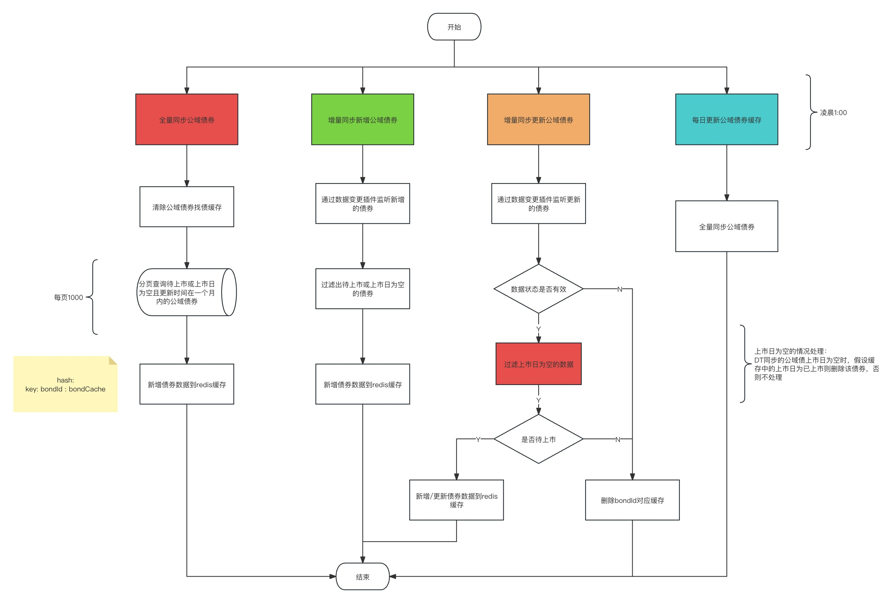
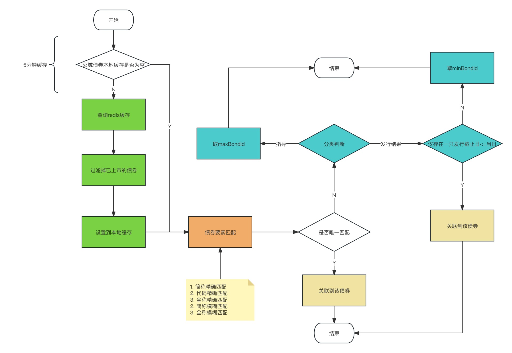
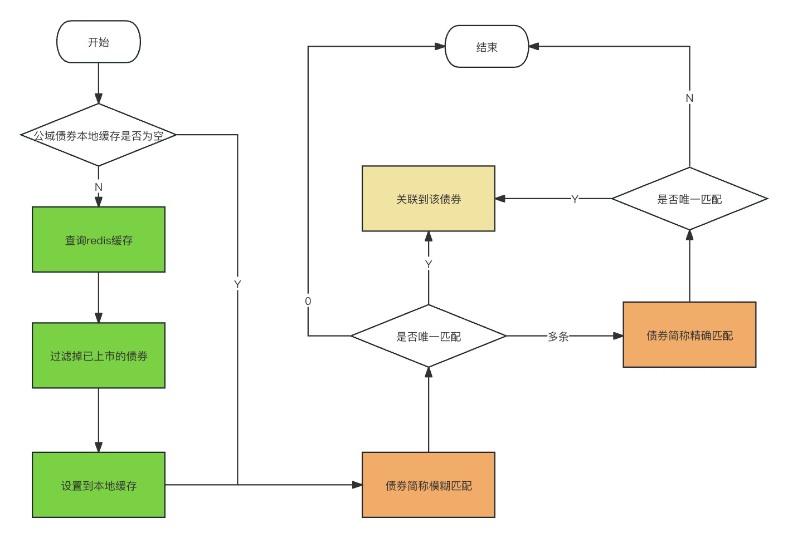

[toc]

## 1.需求文档

### 1.1需求文档地址

[【新债库】独立面板新债群发--粘贴识别群发匹配全市场债券（公域）逻辑优化](https://www.tapd.cn/62488930/prong/stories/view/1162488930001013917?url_cache_key=from_url_iteration_list_0409fca0abfbf79af454a7800e90ae7c&action_entry_type=stories)

[【新债库与新债日历整合】快捷选项查询逻辑优化](https://www.tapd.cn/62488930/prong/stories/view/1162488930001013782?url_cache_key=from_url_iteration_list_0409fca0abfbf79af454a7800e90ae7c&action_entry_type=stories)

[QTO改版对指导、发行结果、关注债券、自动转发的影响](https://www.tapd.cn/62488930/prong/stories/view/1162488930001013908?url_cache_key=from_url_iteration_list_0409fca0abfbf79af454a7800e90ae7c&action_entry_type=stories)


## 2. 系统方案设计

### 2.1 独立面板新债群发--粘贴识别群发匹配全市场债券（公域）

#### 2.1.1 提供识别导入 `QTO` 公域债券找债接口

详见 `2.3.1` 章节

#### 2.1.2 快捷选项按钮加锁

- 分组为`QTO`版本
  - 新增字段标识：快捷选项中的 “==意向客户==”、“==投过同发行人==”选项上锁
  - 不返回对应选项的数据

### 2.2 快捷选项查询逻辑优化

- 内存查询快捷选项的三个日期组之间，是或的关系
- **旧版的是否也改成或的关系** ？？？


### 2.3 QTO改版对指导、发行结果、关注债券、自动转发的影响

#### 2.3.1 `QTO` 所有找债业务逻辑改造

##### 2.3.1.1 公域债券缓存字段定义说明

```java
/**
* redis hash:
*	key: bondId:{@class ShareBondCache}
*
*/
@Data
public class ShareBondCache {
	
    private String bondId;

    private Integer bondInnerCode;

    private String code;

    private String simpleName;

    private String fullName;

    @ApiModelProperty(value = "发行截止日")
    private String issueEndDate;

    @ApiModelProperty(value = "上市日")
    private LocalDate ipoDateConvert;

}
```

##### 2.3.1.2 公域债券缓存生成流程




##### 2.3.1.3 指导/发行结果/中标结果 `QTO` 找债流程




##### 2.3.1.4 广告群发 `QTO` 找债流程



##### 2.3.1.5 找债逻辑调用处

```java
// 1.右面板广告语料解析匹配: /ad/org-ad-group-send-info-entity/parse-match


// 2.指导发送：guidanceissuancesend.chain.MatchBondBizHandler#process


// 3.按模板载入时找债：NlpParseResultAndBondDataProviderDecorator#getStandardFields


// 4.获取指导发送详情：/bond_guidance/send_details


// 5.中标结果导入找债：/bond/nlp_win_bid/import


// 6.指导/中标结果语义解析找债：AbstractParseResultHandler#getMatchBondMap


// 7.群发/右面板 识别导入：/right-panel/primary-bond/match

```


##### 2.3.1.6 `QTO`、`PRO ` 找债逻辑调用处兼容流程


### 2.4 `QTO` 改造外部看板影响

#### 2.4.1 看板债券数据查询

适配查询公域债券数据接口

#### 2.4.2 找债范围&找债逻辑

详见 `2.3.1.6` 章节

#### 2.4.3 指导/发行结果解析设置

所有查询设置的接口都兼容 `QTO` 版本，如果为 `QTO` 版本，则移除==我负责==的选项(`6`)，`债销Q` ,`投标Q` 都一样

- 解析上屏提醒设置
- 页面查询提醒设置


#### 2.4.4 指导/发行结果群发快捷选项

```java
// 接口
// 1. /primary_bond_sale/bond_guidance/send_details
// 2. /primary_bond_sale/bond_guidance/panel/send_details
// 3. /primary_bond_sale/ad/org-ad-group-send-info-entity/user_group_info
```


- 分组为 `QTO` 版本新债销售

  - 新增字段标识：快捷选项中的“==给我投标==”、“==意向客户==”、“==本司接标==”、“==投过同发行人==”选项上锁

  - 不返回对应选项的数据

    

- 分组为 `QTO` 版本新债投标

  - 新增字段标识：快捷选项中的“==对应投资经理==”选项上锁，不支持勾选
  - 不返回对应选项的数据


### 2.5 `QTO` 改造对内部看板影响

#### 2.5.1 看板债券数据查询

同外部指导

#### 2.5.2 找债范围&找债逻辑

详见 `2.3.1.6` 章节

#### 2.5.3 指导/发行结果群发快捷选项

同外部指导


### 2.6 `QTO` 改造对中标结果影响

#### 2.6.1解析上屏逻辑

同 `PRO` 版本中标结果解析上屏逻辑


#### 2.6.2 解析上屏找债范围&找债逻辑

同`QTO` 发行结果找债逻辑


#### 2.6.3 看板债券数据查询

适配查询公域债券数据接口


#### 2.6.4 识别导入找债范围

同 `2.6.2` 章节

#### 2.6.5 搜索可关联债券

适配查询公域债券数据接口


### 2.7 `QTO` 改造对群发语义解析影响

同 `2.1` 章节


### 2.8 **版本切换债券附属数据**

- QTO版本切换为PRO版本，债券附属数据无需处理（QTO时公域数据有私域债券ID，切换后，仍可根据私域债券ID同步DT券后将其挂在私域券下）；

- PRO版本切换至QTO版本，私域债券替换公域债券后，将债券附属数据挂在公域数据上，对于未替换的数据则暂不处理；