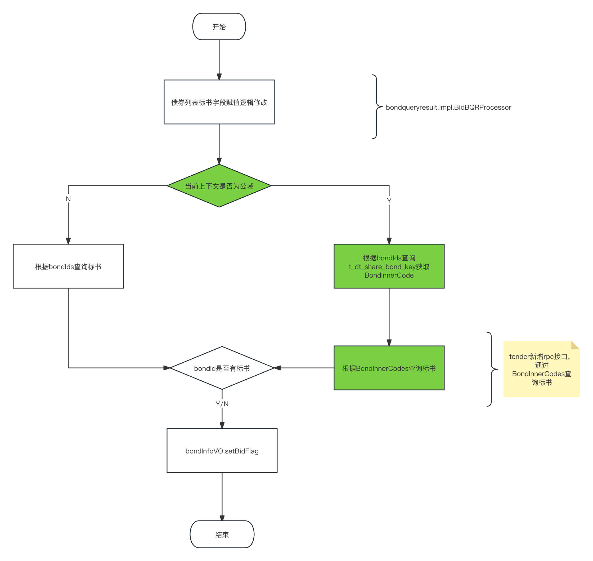
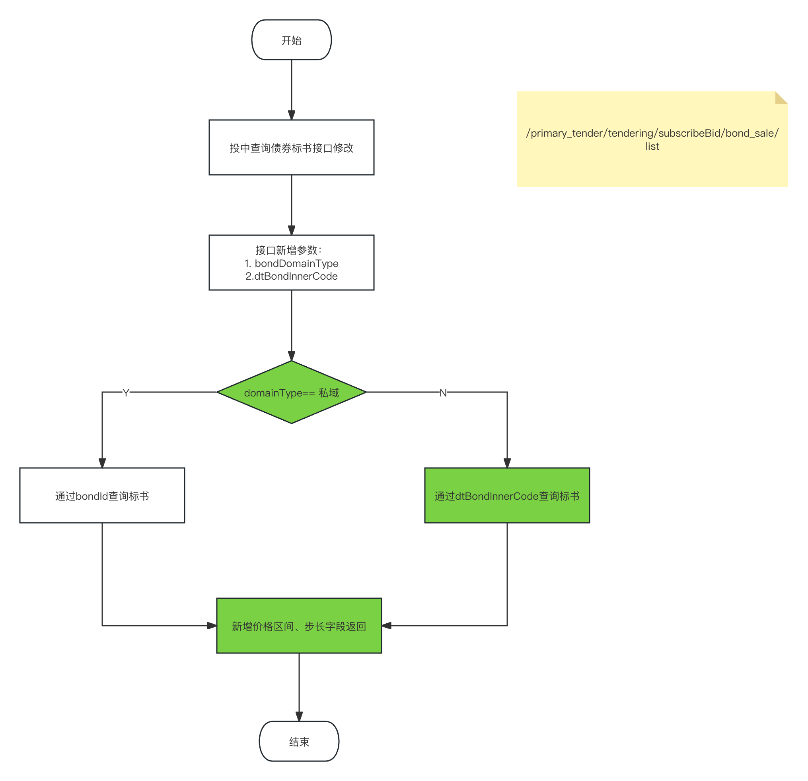
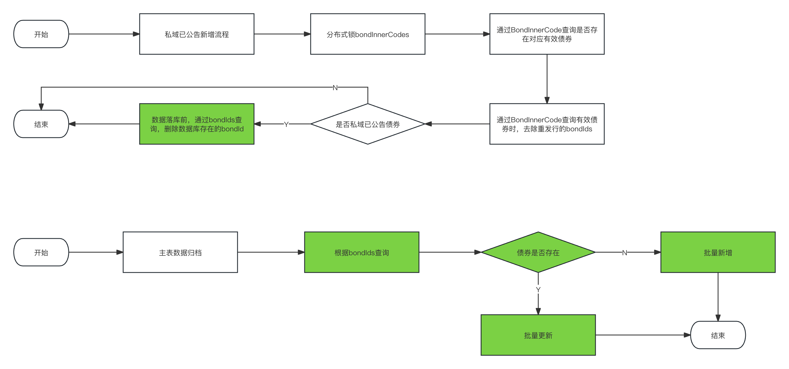

[toc]

## 1.需求文档

### 1.1 需求文档地址

[【新债库】公域债券，展示DT的标书](https://www.tapd.cn/62488930/prong/stories/view/1162488930001013997?url_cache_key=from_url_iteration_list_0409fca0abfbf79af454a7800e90ae7c&action_entry_type=stories)

[【新债库】PRO分组债券拉取逻辑优化](https://www.tapd.cn/62488930/prong/stories/view/1162488930001014220?url_cache_key=from_url_iteration_list_0409fca0abfbf79af454a7800e90ae7c&action_entry_type=stories)

## 2. 系统方案设计

### 2.1 债券列表查询兼容公域债券获取标书流程

### 2.2 查询公域、私域债券标书接口流程

### 2.3 DT私域债券拉取优化 & 私域债券归档
