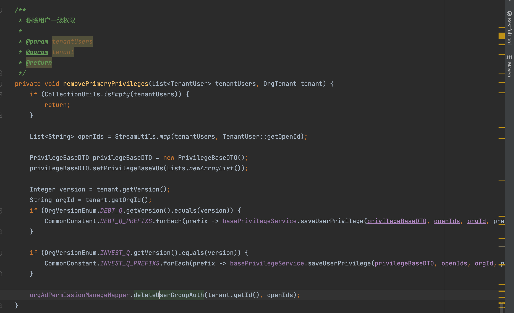

[toc]


## 1.需求文档

### 1.1 需求文档地址

[北极星权限合并适配QTO产品方案](https://www.tapd.cn/62488930/prong/stories/view/1162488930001014379?url_cache_key=from_url_iteration_list_0409fca0abfbf79af454a7800e90ae7c&action_entry_type=stories)

## 2. 系统方案设计

### 2.1 新增债券一级权限码涉及改动点

#### 2.1.1 qtrade-component-privilege-gray-starter

```java
// 1. 新债销售权限码常量类被引用的权限码都需要加上一级权限码 com.qtrade.cola.privilege.common.constant.DebtPrivilegeCodeConstant
// 2. 新债投标权限码常量类被引用的权限码都需要加上一级权限码 com.qtrade.cola.privilege.common.constant.InvestPrivilegeCodeConstant

// such as:
// 债销本分组权限码：com.qtrade.cola.privilege.common.constant.DebtPrivilegeCodeConstant#CURRENT_TENANT
	// 被以下类引用
		// com.qtrade.cola.privilege.common.constant.PrivilegeCodeBizConstant
		// com.qtrade.cola.privilege.util.PrivilegeUtil
  // 在 DebtPrivilegeCodeConstant#CURRENT_TENANT调用处，新增 `203001`


```


- 如果是投标QTO，又配置了本部门权限码，就默认为部门管理员


#### 2.1.2 primary_bond_sale、polaris-guide-result-service

```java

2.1.2.1 权限码引用说明
// com.qtrade.primary.bondsale.bids.refactor.common.constant.PrivilegeOrderConstant
// com.qtrade.cola.privilege.common.constant.DebtPrivilegeCodeConstant
// com.qtrade.cola.privilege.common.constant.InvestPrivilegeCodeConstant

2.1.2.2
// com.qtrade.primary.bondsale.bids.service.dubbo.PrivilegeRpc

2.1.2.3
// com.qtrade.primary.bondsale.interceptor.NewPrivilegeInterceptor
 
2.1.2.4
// com.qtrade.polaris.tenant.api.common.enums.OrgTenantVersionEnum
 
2.1.2.5
// com.qtrade.primary.bondsale.interceptor.LoginInterceptor

```


##### 2.1.2.1 权限码引用说明

| 功能                              | 新债销售                                      | 新债投标                   | 调用处                                                       | 核心逻辑                                       | 修改点                                           | 其他     |
| --------------------------------- | --------------------------------------------- | -------------------------- | ------------------------------------------------------------ | ---------------------------------------------- | ------------------------------------------------ | -------- |
| 全局设置-公共表头设置             | 202005                                        | 212002                     | checkGrayPrivilegePermission                                 | 判断是否包含对应分组版本的权限码               | 该用户是否包含任意一个权限码                     | 截图说明 |
| ~~已公告券截标提醒设置~~          |                                               |                            |                                                              |                                                |                                                  |          |
| ~~债券负责人设置~~                |                                               |                            |                                                              |                                                |                                                  |          |
| 自动转发                          | 1080                                          | 1085                       | @NewPrivilegeOrder                                           | controller权限拦截                             | 当注解包含债券、投标权限码，则新增债券一级权限码 |          |
| 新债日历                          | 1023-1                                        | 1027-1                     | @NewPrivilegeOrder、predicateNewBondUser                     | controller权限拦截                             | 当注解包含债券、投标权限码，则新增债券一级权限码 | 截图说明 |
| 债券删除、编辑                    | 信用债/利率债1023-1-20-2、ABS/ABN 1023-1-21-2 | 1027-1-9                   | @NewPrivilegeOrder                                           | controller权限拦截                             | 当注解包含债券、投标权限码，则新增债券一级权限码 |          |
| 债券状态手动变更                  | 1023-1-10                                     | 1027-1-10                  | @NewPrivilegeOrder                                           | controller权限拦截                             | 当注解包含债券、投标权限码，则新增债券一级权限码 |          |
| 附件上传、删除、对外开放          | 1023-1-20-4、1023-1-21-4                      | 1027-1-11                  | @NewPrivilegeOrder                                           | controller权限拦截                             | 当注解包含债券、投标权限码，则新增债券一级权限码 |          |
| 债券导入                          | 1023-1-20-1、1023-1-21-1                      | 1027-1-20                  | @NewPrivilegeOrder                                           | controller权限拦截                             | 当注解包含债券、投标权限码，则新增债券一级权限码 |          |
| ~~配置广告~~                      | 1023-1-2                                      | 不需补充                   | @NewPrivilegeOrder、privilegeRpc.getOpenIdsByPrivilegeAndTenantId | 查询分组下有广告权限的用户                     | 本期暂不修改                                     |          |
| ~~新债广播/群发信息~~             | 1023-1-1                                      | 投标Q需补充                | @NewPrivilegeOrder                                           | 只有债销Q能调用                                | 是否新增206000                                   |          |
| 右面板群发                        | 1088                                          | 1038                       | 无                                                           |                                                |                                                  |          |
| 右面板债券一级                    | 1023-1、1080-8、1080-7控制                    | 1027-1、1085-4、1085-3控制 | 新债日历、指导汇总、发行结果汇总                             |                                                |                                                  |          |
| 移动端群发                        | 203001                                        | 213001                     | 无                                                           |                                                |                                                  |          |
| 未公告券                          | 1023-1-22                                     | 1027-1                     | 获取待处理债券                                               | 判断是否包含对应分组版本的权限码，来添加数据源 |                                                  | 截图     |
| 债券导入-未公告券                 | 1023-1-22-1                                   | 1027-1-20                  | @NewPrivilegeOrder                                           | controller权限拦截                             | 当注解包含债券、投标权限码，则新增债券一级权限码 |          |
| 债券删除、编辑-未公告券           | 1023-1-22-2                                   | 1027-1-9                   | @NewPrivilegeOrder                                           | controller权限拦截                             | 当注解包含债券、投标权限码，则新增债券一级权限码 |          |
| 附件上传、删除、对外开放-未公告券 | 1023-1-22-4                                   | 1027-1-11                  | @NewPrivilegeOrder                                           | controller权限拦截                             | 当注解包含债券、投标权限码，则新增债券一级权限码 |          |
| 指导汇总                          | 1080-8                                        | 1085-4                     | @NewPrivilegeOrder、acquirePrivilegeOrder、acquireSummaryPrivilegeUserMap |                                                |                                                  | 截图     |
| 发行结果汇总                      | 1080-7                                        | 1085-3                     | @NewPrivilegeOrder、acquirePrivilegeOrder、acquireSummaryPrivilegeUserMap |                                                |                                                  |          |
| 指导/发行结果看板                 | 1080                                          | 1085                       | @NewPrivilegeOrder                                           | controller权限拦截                             | 当注解包含债券、投标权限码，则新增债券一级权限码 |          |
| 外部识别-债销                     | 1080-2                                        | 1085-1                     | @NewPrivilegeOrder、REGION_GUIDE_RECEIVE_CODES（外部识别集合）、getFirstIntoGuide、setBondCollectByBondId |                                                |                                                  | 截图     |
| 内部转发-债销                     | 1080-3                                        | 1085-2                     | @NewPrivilegeOrder、DEBT_Q_GUIDE_INFO_BOARD_LIST（内部看板集合）、privilegeOrderFilter、saveRegionGuides |                                                |                                                  | 截图     |
| 外部识别-移动                     | 1080-4                                        | 1085-1控制                 | 同1080-2                                                     |                                                |                                                  |          |
| 内部转发-移动                     | 1080-5                                        | 1085-2控制                 | 同1080-3                                                     |                                                |                                                  |          |
| ~~群发-本司接标人员~~             | 1080-6                                        | 不需补充                   | queryGroupInfo                                               |                                                |                                                  |          |
| ~~同步指导-债销~~                 | 1080-9                                        |                            |                                                              |                                                |                                                  |          |
| ~~中标结果看板~~                  | 需补充                                        | 1087                       |                                                              |                                                |                                                  |          |
| 对手方统计                        | 1081-1                                        |                            | 无                                                           |                                                |                                                  |          |

**代码调用处说明**

- 公告表头设置

  

  - 去除版本判断，取3个权限码判断
  - 去除是否灰度判断，只处理新系统逻辑


- 新债日历

 
  - 新增债券一级权限码

- 未公告券：根据版本获取用户权限对应的数据源

 
  - 版本判断修改成权限判断

  

- 指导汇总
  
  

  - 是否可以根据消息类型返回3个指导汇总/发行结果汇总？


- 外部识别

  
  
  - 新增一级权限码
  
  

- 只有债销Q权限，是否新增一级权限码


- 内部转发

  
  - 是否三合一权限码


##### 2.1.2.2 PrivilegeRpc

- 去除 `checkOrgGrayscale` 判断机构是否灰度权限

##### 2.1.2.3 NewPrivilegeInterceptor

- 是否去除校验用户与分组版本一致


​       
- 部门管理员是否添加债销一级权限码，投标q没有部门管理员


##### 2.1.2.4 OrgTenantVersionEnum

###### 2.1.2.4.1 代码涉及引用说明

- 指导、债券群发快捷选项

- 全局设置查询

- 查询指导识别需要提醒的债券

- 自动关注配置

- 指导提醒配置

- 指导群发、内部指导接收
  

###### 2.1.2.4.2 改动点

- 查询用户权限来判断是债销Q还是投资Q

- 全局设置判断用户版本是否可以去除
  


##### 2.1.2.5 LoginInterceptor

- 查询当前用户的权限，设置当前用户权限对应的版本


### 2.2 债券一级权限配置及告警

#### 2.2.1 用户权限配置流程图


- 广告mq、群报价mq版本判断修改
  


### 2.3 系统生成机构默认分组

#### 2.3.1 分组表新增字段

```mysql
ALTER TABLE db_polaris_tenant.t_org_tenant ADD COLUMN `Fdefault_tenant` tinyint(1) NOT NULL DEFAULT '0' COMMENT '是否默认分组：0-否；1-是';

```

#### 2.3.2 默认分组新增逻辑

- 名称：默认分组
- 过期时间：与机构过期时间一致
- 开启的开关：”DT指导同步（默认打开）”、“DT发行结果同步（默认打开）”、“指导看板广告识别（默认打开）”、“用户分档（默认打开）”、新消息链路、新债日历
- 发送新增分组事件、新增分组人员事件


### 2.4 分组属性跑批

#### 2.4.1 记录表新增字段

```mysql
ALTER TABLE db_polaris_tenant.t_tenant_relegation_record ADD COLUMN `Ftype` int(8) NOT NULL DEFAULT '1' COMMENT '记录类型：1-分组升降；2-存在债销、投标PRO';
```


#### 2.4.2 分组升降级跑批流程修改

.jpg)

- 同时存在债销、投标PRO的分组，是否在24:00job重新跑批？


### 2.5 手动新增分组

- 分组选人：==未配置一级权限（200000，1023，1027）==或已在其他分组的用户置灰不可选择
- 确定接口：分组版本为PRO时，判断是否同时有债销PRO、投标PRO用户，有则返回异常信息


### 2.6 手动修改分组


- 分组选人：==未配置一级权限（200000，1023，1027）==或已在其他分组的用户置灰不可选择

- 确定接口：分组版本为PRO时，判断是否同时有债销PRO、投标PRO用户，有则返回异常信息

- 用户移除分组：不要求先将用户权限移除 ？？？

  
  


### 2.7 相关功能影响

#### 2.7.1 指导/结果群发快捷选项影响

- 去除上锁标识、修改成通过权限码返回快捷选项

  


#### 2.7.2 广播群发快捷选项影响

- 去除上锁标识、修改成通过权限码返回快捷选项


#### 2.7.3 自动关注债券


- 根据版本控制是否改成权限码控制，QTO默认返回什么选项？
- 后端返回选中的项，加锁通过前端控制


#### 2.7.4 新债库表头影响

- 无


#### 2.7.5 右面板债券一级

- 前端通过权限码控制


### 2.8 全局设置影响

- 前端通过权限码控制
