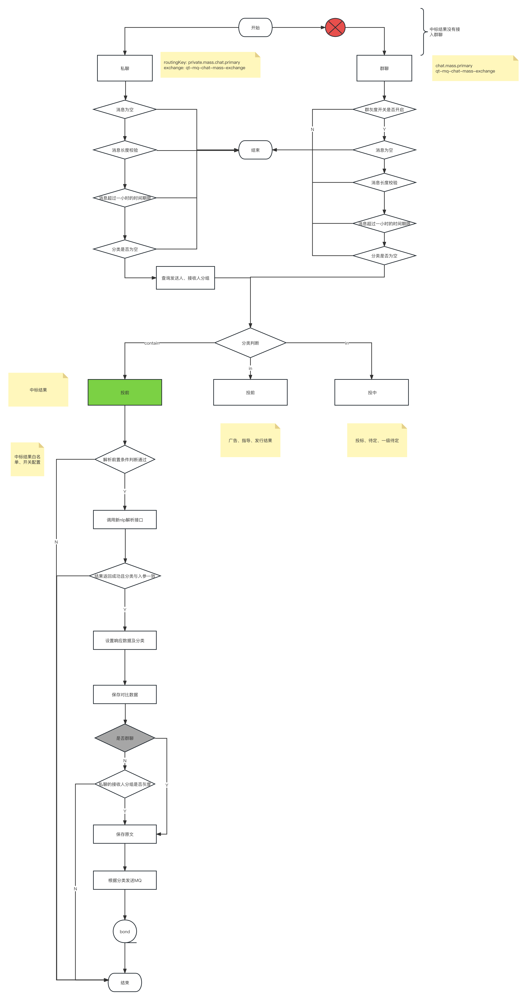

[toc]


### 一、`erp`

#### 1.1 新增投标版本新/旧权限系统的2个权限码：中标结果-投标、外部识别-投标

#### 1.2 新权限码由产品提供

#### 1.3 旧权限码 `sql`

```sql
INSERT INTO `db_appletree`.`t_privilege_info` (`Fname`, `Forder`, `Fparent_order`, `Flevel`, `Ftype`, `Fsys_code`, `Furl`, `Fexpand_yn`, `Fdata_yn`, `Fuser_data_yn`, `Fprivilege_from`, `Fyn`, `Fold_privilege_order`, `Fold_privilege_sub_order`) VALUES ('中标结果-投标', '1087', NULL, 1, 1, NULL, NULL, NULL, NULL, NULL, 1, 1, '1087', NULL);

INSERT INTO `db_appletree`.`t_privilege_info` (`Fname`, `Forder`, `Fparent_order`, `Flevel`, `Ftype`, `Fsys_code`, `Furl`, `Fexpand_yn`, `Fdata_yn`, `Fuser_data_yn`, `Fprivilege_from`, `Fyn`, `Fold_privilege_order`, `Fold_privilege_sub_order`) VALUES ('外部识别-投标', '1087-1', '1087', 2, 1, NULL, NULL, 0, 0, 0, 1, 1, '1087-1', NULL);
```

#### 1.4 代码改造

```java
// 在该常量类新增 中标结果 的权限码前缀
com.qtrade.erp.common.constant.CommonConstant#INVEST_Q_PREFIXS;

```


### 二、`chat-parse`

#### 2.1 新增分类：一级-中标结果信息

#### 2.2 中标结果流程图




**说明**：因旧 `nlp` 接口没有兼容中标结果的解析，旧消息链路不会处理中标结果的业务，有中标结果的分组必须设置为新消息链路

### 三、`bond-sale`

#### 3.1 新增中标结果私聊前置解析接口

接口逻辑同指导信息前置解析

权限码不同、判断是否开启解析开关不同

#### 3.2 新增中标结果消费者
##### 中标结果上屏流程图


#### 3.3 中标结果面板查询

##### 新增查询接口


##### 新增查询更多接口，是否一次性返回所有数据

#### 3.4 解析开关

复用 `t_user_guide_config`表，新增中标结果解析类型

查询、设置接口复用

#### 3.5 数据清理

列表仅展示存在新债库的债券的中标结果，与新债库债券存留时间保持一致；

对于未关联到债券的中标结果，按接收时间往后保留30天；

### 四、`component`

在常量类新增权限码

新增nlp中标结果接口，结果适配


### 五、中标结果信息语义识别下行接口

参数验证、验签参考之前的接口

限流：调用频率不超过1次/分钟

查询appId对应分组的中标结果数据


### 六、中标结果NLP识别

无，文档未提供

### 七、新增表结构

#### 中标结果数据表

```sql
drop table if EXISTS `t_nlp_win_bid_receive`;
CREATE TABLE `t_nlp_win_bid_receive` (
  `Fid` bigint(21) unsigned NOT NULL AUTO_INCREMENT COMMENT '自增id',
  `Fbond_id` bigint(21) NOT NULL COMMENT '关联债券Id',
  `Fopponent_open_id` varchar(64) CHARACTER SET utf8 NOT NULL COMMENT '对手方openId',
  `Fopponent_org_id` varchar(127) CHARACTER SET utf8 NOT NULL COMMENT '对手方机构id',
  `Fopen_id` varchar(64) CHARACTER SET utf8 NOT NULL COMMENT '本方openId',
  `Fmessage_source` tinyint(1) NOT NULL DEFAULT '1' COMMENT '消息来源：1-私聊，2-群聊',
  `Fmessage_id` varchar(225) CHARACTER SET utf8 DEFAULT NULL COMMENT '原文消息Id',
  `Ftenant_id` bigint(19) unsigned NOT NULL COMMENT '本方分组id',
  `Fshow_flag` tinyint(1) NOT NULL DEFAULT '1' COMMENT '是否上屏：1-是，0-否',
  `Factual_vol_recog` varchar(50) CHARACTER SET utf8 DEFAULT NULL COMMENT '配售面值(亿)',
  `Factual_rate_recog` varchar(50) CHARACTER SET utf8 DEFAULT NULL COMMENT '中标利率',
  `Fbid_yn_recog` tinyint(1) NOT NULL DEFAULT '0' COMMENT '是否中标：1-是，0-否',
  `Fpay_date` varchar(50) CHARACTER SET utf8 DEFAULT NULL COMMENT '缴款日',
  `Fipo_date` varchar(50) CHARACTER SET utf8 DEFAULT NULL COMMENT '上市日',
  `Fcreate_time` timestamp NOT NULL DEFAULT CURRENT_TIMESTAMP COMMENT '创建时间',
  `Fupdate_time` timestamp NOT NULL DEFAULT CURRENT_TIMESTAMP ON UPDATE CURRENT_TIMESTAMP COMMENT '更新时间',
  `Fnlp_result` varchar(2000) DEFAULT NULL COMMENT 'nlp解析结果',
  PRIMARY KEY (`Fid`),
  KEY `idx_bond_id` (`Fbond_id`) USING BTREE,
  KEY `idx_open_id` (`Fopen_id`) USING BTREE,
  KEY `idx_tenant_id` (`Ftenant_id`) USING BTREE
) ENGINE=InnoDB AUTO_INCREMENT=1 DEFAULT CHARSET=utf8mb4 COMMENT='中标结果接收表';

drop table if EXISTS `t_nlp_win_bid_receive_history`;
CREATE TABLE `t_nlp_win_bid_receive_history` (
  `Fid` bigint(21) unsigned NOT NULL AUTO_INCREMENT COMMENT '自增id',
  `Fbond_id` bigint(21) NOT NULL COMMENT '关联债券Id',
  `Fopponent_open_id` varchar(64) CHARACTER SET utf8 NOT NULL COMMENT '对手方openId',
  `Fopponent_org_id` varchar(127) CHARACTER SET utf8 NOT NULL COMMENT '对手方机构id',
  `Fopen_id` varchar(64) CHARACTER SET utf8 NOT NULL COMMENT '本方openId',
  `Fmessage_source` tinyint(1) NOT NULL DEFAULT '1' COMMENT '消息来源：1-私聊，2-群聊',
  `Fmessage_id` varchar(225) CHARACTER SET utf8 DEFAULT NULL COMMENT '原文消息Id',
  `Ftenant_id` bigint(19) unsigned NOT NULL COMMENT '本方分组id',
  `Fshow_flag` tinyint(1) NOT NULL DEFAULT '1' COMMENT '是否上屏：1-是，0-否',
  `Factual_vol_recog` varchar(50) CHARACTER SET utf8 DEFAULT NULL COMMENT '配售面值(亿)',
  `Factual_rate_recog` varchar(50) CHARACTER SET utf8 DEFAULT NULL COMMENT '中标利率',
  `Fbid_yn_recog` tinyint(1) NOT NULL DEFAULT '0' COMMENT '是否中标：1-是，0-否',
  `Fpay_date` varchar(50) CHARACTER SET utf8 DEFAULT NULL COMMENT '缴款日',
  `Fipo_date` varchar(50) CHARACTER SET utf8 DEFAULT NULL COMMENT '上市日',
  `Fcreate_time` timestamp NOT NULL DEFAULT CURRENT_TIMESTAMP COMMENT '创建时间',
  `Fupdate_time` timestamp NOT NULL DEFAULT CURRENT_TIMESTAMP ON UPDATE CURRENT_TIMESTAMP COMMENT '更新时间',
  `Fnlp_result` varchar(2000) DEFAULT NULL COMMENT 'nlp解析结果',
  PRIMARY KEY (`Fid`),
  KEY `idx_bond_id` (`Fbond_id`) USING BTREE,
  KEY `idx_open_id` (`Fopen_id`) USING BTREE,
  KEY `idx_tenant_id` (`Ftenant_id`) USING BTREE
) ENGINE=InnoDB AUTO_INCREMENT=1 DEFAULT CHARSET=utf8mb4 COMMENT='中标结果接收历史表';
```

