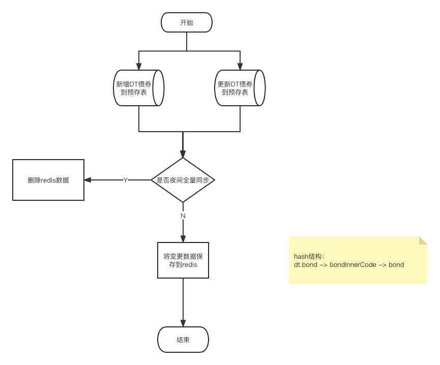
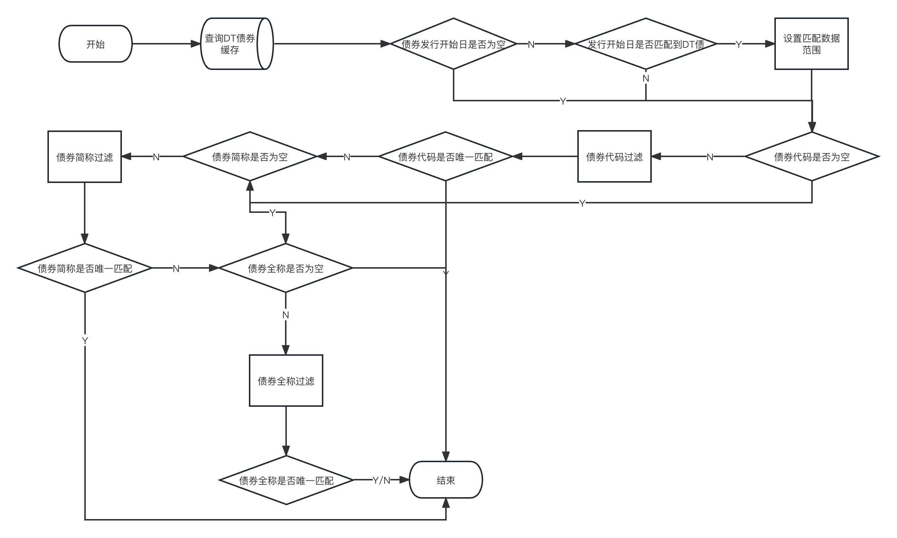
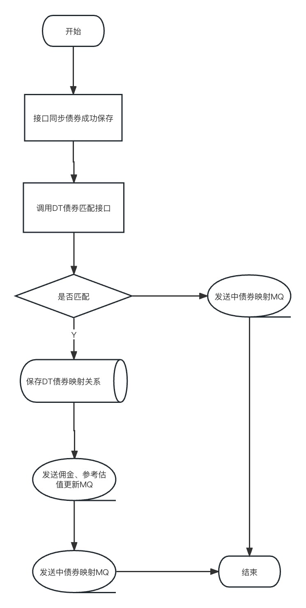
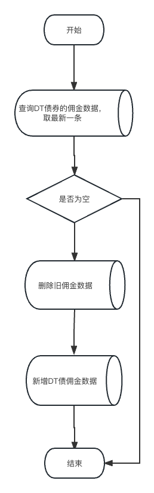
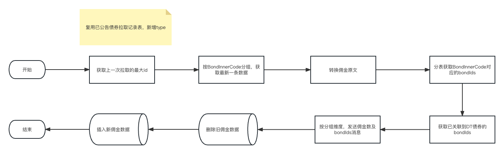
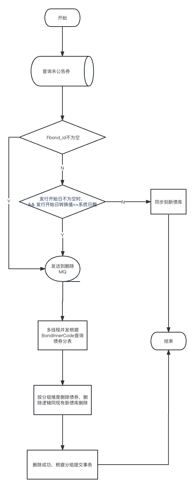
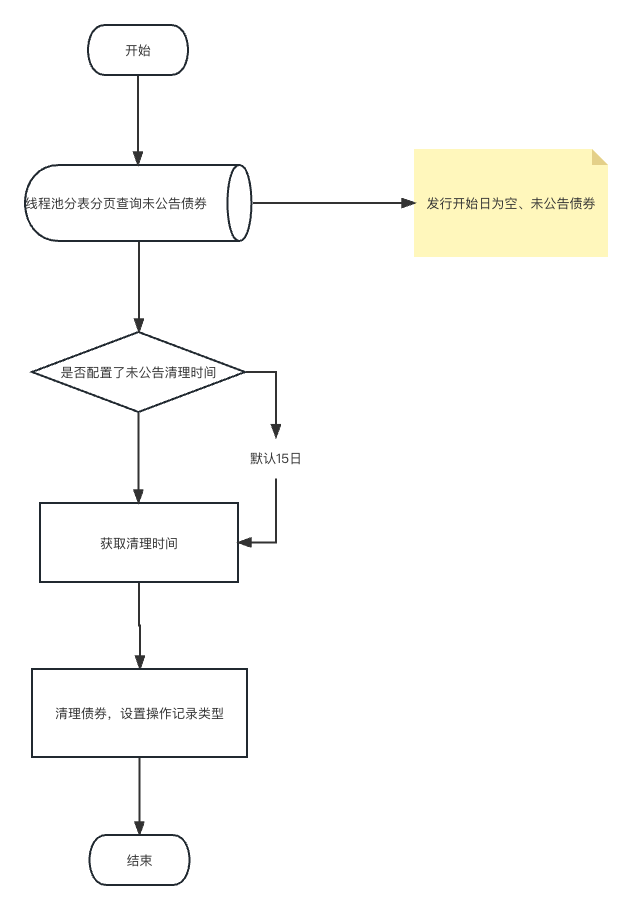

[toc]


## 1. 表结构

```sql
-- 其他债券与dt债券映射关系表
CREATE TABLE `db_primary_bond_sale`.`t_all_for_dt_bond_mapping` (
  `Fid` bigint(21) unsigned NOT NULL AUTO_INCREMENT COMMENT '自增id',
  `Fbond_id` bigint(21) NOT NULL COMMENT '关联债券Id',
	`Fbond_inner_code` int(11) NOT NULL COMMENT 'newBondInnerCode',
	`Fcb_bond_inner_code` varchar(100) DEFAULT NULL COMMENT '中债CDCC提供的唯一性编码',
  `Fdt_bond_inner_code` int(11) DEFAULT NULL COMMENT 'DT债券的唯一性编码',
  `Forg_id` varchar(127) NOT NULL COMMENT '机构id',
  `Ftenant_id` bigint(19) unsigned NOT NULL COMMENT '本方分组id',
  `Fcreate_time` timestamp NOT NULL DEFAULT CURRENT_TIMESTAMP COMMENT '创建时间',
  `Fupdate_time` timestamp NOT NULL DEFAULT CURRENT_TIMESTAMP ON UPDATE CURRENT_TIMESTAMP COMMENT '更新时间',
  PRIMARY KEY (`Fid`),
  KEY `idx_bond_id` (`Fbond_id`) USING BTREE,
  KEY `idx_bond_inner_code` (`Fbond_inner_code`) USING BTREE,
) ENGINE=InnoDB AUTO_INCREMENT=1 DEFAULT CHARSET=utf8mb4 COMMENT='其他债券与dt债券映射关系表';


-- 费用子表新加字段
ALTER TABLE `db_primary_bond_sale`.`t_primary_cost_info_1` ADD COLUMN `Fmsg_id` varchar(128) DEFAULT NULL COMMENT '消息id';
ALTER TABLE `db_primary_bond_sale`.`t_primary_cost_info_1` ADD COLUMN `Fmsg_time` datetime DEFAULT NULL COMMENT '消息时间';
ALTER TABLE `db_primary_bond_sale`.`t_primary_cost_info_1` ADD COLUMN `Fgroup_code` varchar(32) DEFAULT NULL COMMENT '群号';
ALTER TABLE `db_primary_bond_sale`.`t_primary_cost_info_1` ADD COLUMN `Fgroup_name` varchar(64) DEFAULT NULL COMMENT '群名称';

ALTER TABLE `db_primary_bond_sale`.`t_primary_cost_info_2` ADD COLUMN `Fmsg_id` varchar(128) DEFAULT NULL COMMENT '消息id';
ALTER TABLE `db_primary_bond_sale`.`t_primary_cost_info_2` ADD COLUMN `Fmsg_time` datetime DEFAULT NULL COMMENT '消息时间';
ALTER TABLE `db_primary_bond_sale`.`t_primary_cost_info_2` ADD COLUMN `Fgroup_code` varchar(32) DEFAULT NULL COMMENT '群号';
ALTER TABLE `db_primary_bond_sale`.`t_primary_cost_info_2` ADD COLUMN `Fgroup_name` varchar(64) DEFAULT NULL COMMENT '群名称';

ALTER TABLE `db_primary_bond_sale`.`t_primary_cost_info_3` ADD COLUMN `Fmsg_id` varchar(128) DEFAULT NULL COMMENT '消息id';
ALTER TABLE `db_primary_bond_sale`.`t_primary_cost_info_3` ADD COLUMN `Fmsg_time` datetime DEFAULT NULL COMMENT '消息时间';
ALTER TABLE `db_primary_bond_sale`.`t_primary_cost_info_3` ADD COLUMN `Fgroup_code` varchar(32) DEFAULT NULL COMMENT '群号';
ALTER TABLE `db_primary_bond_sale`.`t_primary_cost_info_3` ADD COLUMN `Fgroup_name` varchar(64) DEFAULT NULL COMMENT '群名称';

ALTER TABLE `db_primary_bond_sale`.`t_primary_cost_info_4` ADD COLUMN `Fmsg_id` varchar(128) DEFAULT NULL COMMENT '消息id';
ALTER TABLE `db_primary_bond_sale`.`t_primary_cost_info_4` ADD COLUMN `Fmsg_time` datetime DEFAULT NULL COMMENT '消息时间';
ALTER TABLE `db_primary_bond_sale`.`t_primary_cost_info_4` ADD COLUMN `Fgroup_code` varchar(32) DEFAULT NULL COMMENT '群号';
ALTER TABLE `db_primary_bond_sale`.`t_primary_cost_info_4` ADD COLUMN `Fgroup_name` varchar(64) DEFAULT NULL COMMENT '群名称';

ALTER TABLE `db_primary_bond_sale`.`t_primary_cost_info_5` ADD COLUMN `Fmsg_id` varchar(128) DEFAULT NULL COMMENT '消息id';
ALTER TABLE `db_primary_bond_sale`.`t_primary_cost_info_5` ADD COLUMN `Fmsg_time` datetime DEFAULT NULL COMMENT '消息时间';
ALTER TABLE `db_primary_bond_sale`.`t_primary_cost_info_5` ADD COLUMN `Fgroup_code` varchar(32) DEFAULT NULL COMMENT '群号';
ALTER TABLE `db_primary_bond_sale`.`t_primary_cost_info_5` ADD COLUMN `Fgroup_name` varchar(64) DEFAULT NULL COMMENT '群名称';

ALTER TABLE `db_primary_bond_sale`.`t_primary_cost_info_6` ADD COLUMN `Fmsg_id` varchar(128) DEFAULT NULL COMMENT '消息id';
ALTER TABLE `db_primary_bond_sale`.`t_primary_cost_info_6` ADD COLUMN `Fmsg_time` datetime DEFAULT NULL COMMENT '消息时间';
ALTER TABLE `db_primary_bond_sale`.`t_primary_cost_info_6` ADD COLUMN `Fgroup_code` varchar(32) DEFAULT NULL COMMENT '群号';
ALTER TABLE `db_primary_bond_sale`.`t_primary_cost_info_6` ADD COLUMN `Fgroup_name` varchar(64) DEFAULT NULL COMMENT '群名称';

ALTER TABLE `db_primary_bond_sale`.`t_primary_cost_info_7` ADD COLUMN `Fmsg_id` varchar(128) DEFAULT NULL COMMENT '消息id';
ALTER TABLE `db_primary_bond_sale`.`t_primary_cost_info_7` ADD COLUMN `Fmsg_time` datetime DEFAULT NULL COMMENT '消息时间';
ALTER TABLE `db_primary_bond_sale`.`t_primary_cost_info_7` ADD COLUMN `Fgroup_code` varchar(32) DEFAULT NULL COMMENT '群号';
ALTER TABLE `db_primary_bond_sale`.`t_primary_cost_info_7` ADD COLUMN `Fgroup_name` varchar(64) DEFAULT NULL COMMENT '群名称';

ALTER TABLE `db_primary_bond_sale`.`t_primary_cost_info_8` ADD COLUMN `Fmsg_id` varchar(128) DEFAULT NULL COMMENT '消息id';
ALTER TABLE `db_primary_bond_sale`.`t_primary_cost_info_8` ADD COLUMN `Fmsg_time` datetime DEFAULT NULL COMMENT '消息时间';
ALTER TABLE `db_primary_bond_sale`.`t_primary_cost_info_8` ADD COLUMN `Fgroup_code` varchar(32) DEFAULT NULL COMMENT '群号';
ALTER TABLE `db_primary_bond_sale`.`t_primary_cost_info_8` ADD COLUMN `Fgroup_name` varchar(64) DEFAULT NULL COMMENT '群名称';

ALTER TABLE `db_primary_bond_sale`.`t_primary_cost_info_9` ADD COLUMN `Fmsg_id` varchar(128) DEFAULT NULL COMMENT '消息id';
ALTER TABLE `db_primary_bond_sale`.`t_primary_cost_info_9` ADD COLUMN `Fmsg_time` datetime DEFAULT NULL COMMENT '消息时间';
ALTER TABLE `db_primary_bond_sale`.`t_primary_cost_info_9` ADD COLUMN `Fgroup_code` varchar(32) DEFAULT NULL COMMENT '群号';
ALTER TABLE `db_primary_bond_sale`.`t_primary_cost_info_9` ADD COLUMN `Fgroup_name` varchar(64) DEFAULT NULL COMMENT '群名称';

ALTER TABLE `db_primary_bond_sale`.`t_primary_cost_info_10` ADD COLUMN `Fmsg_id` varchar(128) DEFAULT NULL COMMENT '消息id';
ALTER TABLE `db_primary_bond_sale`.`t_primary_cost_info_10` ADD COLUMN `Fmsg_time` datetime DEFAULT NULL COMMENT '消息时间';
ALTER TABLE `db_primary_bond_sale`.`t_primary_cost_info_10` ADD COLUMN `Fgroup_code` varchar(32) DEFAULT NULL COMMENT '群号';
ALTER TABLE `db_primary_bond_sale`.`t_primary_cost_info_10` ADD COLUMN `Fgroup_name` varchar(64) DEFAULT NULL COMMENT '群名称';

ALTER TABLE `db_primary_bond_sale`.`t_primary_cost_info_11` ADD COLUMN `Fmsg_id` varchar(128) DEFAULT NULL COMMENT '消息id';
ALTER TABLE `db_primary_bond_sale`.`t_primary_cost_info_11` ADD COLUMN `Fmsg_time` datetime DEFAULT NULL COMMENT '消息时间';
ALTER TABLE `db_primary_bond_sale`.`t_primary_cost_info_11` ADD COLUMN `Fgroup_code` varchar(32) DEFAULT NULL COMMENT '群号';
ALTER TABLE `db_primary_bond_sale`.`t_primary_cost_info_11` ADD COLUMN `Fgroup_name` varchar(64) DEFAULT NULL COMMENT '群名称';

ALTER TABLE `db_primary_bond_sale`.`t_primary_cost_info_12` ADD COLUMN `Fmsg_id` varchar(128) DEFAULT NULL COMMENT '消息id';
ALTER TABLE `db_primary_bond_sale`.`t_primary_cost_info_12` ADD COLUMN `Fmsg_time` datetime DEFAULT NULL COMMENT '消息时间';
ALTER TABLE `db_primary_bond_sale`.`t_primary_cost_info_12` ADD COLUMN `Fgroup_code` varchar(32) DEFAULT NULL COMMENT '群号';
ALTER TABLE `db_primary_bond_sale`.`t_primary_cost_info_12` ADD COLUMN `Fgroup_name` varchar(64) DEFAULT NULL COMMENT '群名称';

ALTER TABLE `db_primary_bond_sale`.`t_primary_cost_info_13` ADD COLUMN `Fmsg_id` varchar(128) DEFAULT NULL COMMENT '消息id';
ALTER TABLE `db_primary_bond_sale`.`t_primary_cost_info_13` ADD COLUMN `Fmsg_time` datetime DEFAULT NULL COMMENT '消息时间';
ALTER TABLE `db_primary_bond_sale`.`t_primary_cost_info_13` ADD COLUMN `Fgroup_code` varchar(32) DEFAULT NULL COMMENT '群号';
ALTER TABLE `db_primary_bond_sale`.`t_primary_cost_info_13` ADD COLUMN `Fgroup_name` varchar(64) DEFAULT NULL COMMENT '群名称';

ALTER TABLE `db_primary_bond_sale`.`t_primary_cost_info_14` ADD COLUMN `Fmsg_id` varchar(128) DEFAULT NULL COMMENT '消息id';
ALTER TABLE `db_primary_bond_sale`.`t_primary_cost_info_14` ADD COLUMN `Fmsg_time` datetime DEFAULT NULL COMMENT '消息时间';
ALTER TABLE `db_primary_bond_sale`.`t_primary_cost_info_14` ADD COLUMN `Fgroup_code` varchar(32) DEFAULT NULL COMMENT '群号';
ALTER TABLE `db_primary_bond_sale`.`t_primary_cost_info_14` ADD COLUMN `Fgroup_name` varchar(64) DEFAULT NULL COMMENT '群名称';

ALTER TABLE `db_primary_bond_sale`.`t_primary_cost_info_15` ADD COLUMN `Fmsg_id` varchar(128) DEFAULT NULL COMMENT '消息id';
ALTER TABLE `db_primary_bond_sale`.`t_primary_cost_info_15` ADD COLUMN `Fmsg_time` datetime DEFAULT NULL COMMENT '消息时间';
ALTER TABLE `db_primary_bond_sale`.`t_primary_cost_info_15` ADD COLUMN `Fgroup_code` varchar(32) DEFAULT NULL COMMENT '群号';
ALTER TABLE `db_primary_bond_sale`.`t_primary_cost_info_15` ADD COLUMN `Fgroup_name` varchar(64) DEFAULT NULL COMMENT '群名称';

ALTER TABLE `db_primary_bond_sale`.`t_primary_cost_info_16` ADD COLUMN `Fmsg_id` varchar(128) DEFAULT NULL COMMENT '消息id';
ALTER TABLE `db_primary_bond_sale`.`t_primary_cost_info_16` ADD COLUMN `Fmsg_time` datetime DEFAULT NULL COMMENT '消息时间';
ALTER TABLE `db_primary_bond_sale`.`t_primary_cost_info_16` ADD COLUMN `Fgroup_code` varchar(32) DEFAULT NULL COMMENT '群号';
ALTER TABLE `db_primary_bond_sale`.`t_primary_cost_info_16` ADD COLUMN `Fgroup_name` varchar(64) DEFAULT NULL COMMENT '群名称';

ALTER TABLE `db_primary_bond_sale`.`t_primary_cost_info_archive` ADD COLUMN `Fmsg_id` varchar(128) DEFAULT NULL COMMENT '消息id';
ALTER TABLE `db_primary_bond_sale`.`t_primary_cost_info_archive` ADD COLUMN `Fmsg_time` datetime DEFAULT NULL COMMENT '消息时间';
ALTER TABLE `db_primary_bond_sale`.`t_primary_cost_info_archive` ADD COLUMN `Fgroup_code` varchar(32) DEFAULT NULL COMMENT '群号';
ALTER TABLE `db_primary_bond_sale`.`t_primary_cost_info_archive` ADD COLUMN `Fgroup_name` varchar(64) DEFAULT NULL COMMENT '群名称';


```


## 2. 接口同步债券映射

### 2.1接口同步字段格式处理

> 数字、“括号（）”、“分割符-”、“点 .”、 “逗号，”、“单引号‘’”全部转换为英文半角

1. 发行人名称

2. 债券代码


### 2.2 `DT` 每日同步债券缓存



### 2.3 `DT` 债券找债逻辑


### 2.4 接口同步映射 `DT` 债券逻辑



## 3. 团费/佣金拉取及补充到接口同步债券

### 3.1 补充接口同步债券佣金数据



### 3.2 已公告拉取佣金流程



### 3.3 未公告拉取佣金流程

1. 将佣金相关字段转换成佣金子表数据
2. 先删除旧佣金子表数据，再插入新数据

## 4. 未公告清理优化

### 4.1 手工同步新债库日历未公告券

- 新增 `Fbond_id` == null的查询条件

### 4.2 未公告拉取实时删除债券



### 4.3 跑批清理未公告债券

## 5. `ERP` 同步 `DT` 债券开关

- 修改根据配置的已公告、未公告是否开启  `DT`  同步来控制是否同步债券逻辑

## 6. 遗留问题

- `DT` 债券删除是否需要删除关联关系